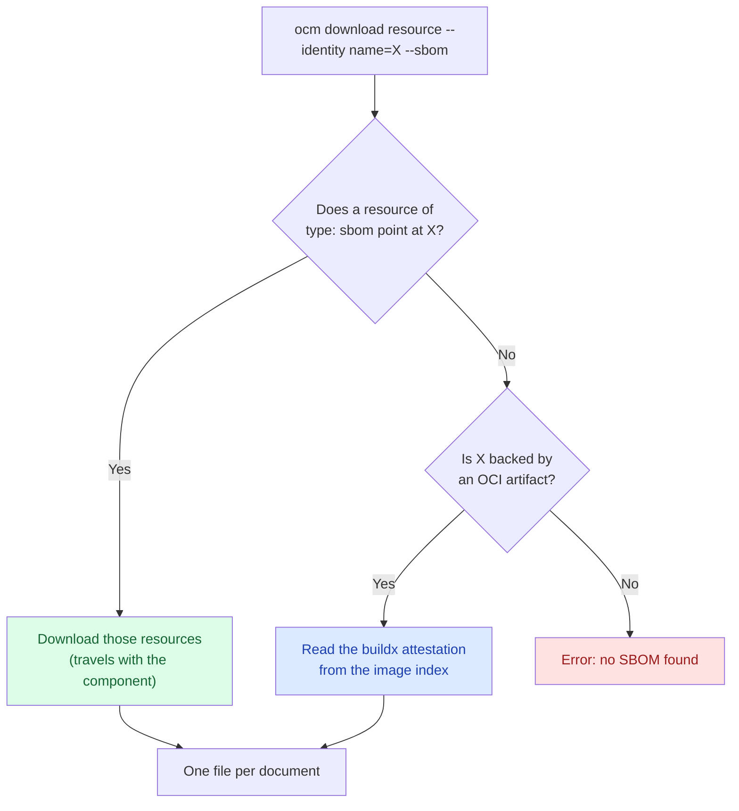


This guide continues from
[Add SBOMs]().
It assumes the `/tmp/ocm-sbom-tutorial` workspace and the `./transport-archive`
CTF from that guide already exist, with a linked SBOM on the `ocm-cli` resource and
the `podinfo` image carrying a BuildKit attestation. Complete it before running
the steps below.


With the component version in `./transport-archive`, you retrieve the SBOM for both
resources with the same command, even though the two SBOMs got there in completely
different ways. For the why, see [Software Bills of Materials]().


`ocm download resource --sbom` is experimental. What is discovered, how it is written out, and the flag itself may
change in a future release depending on user feedback to offer a better UX.


## What You'll Learn

- Retrieve both a linked and an attached SBOM with one command, `ocm download resource --sbom`
- Collect the SBOMs of an entire component version with a small script
- Scan the result with Trivy
- Understand what happens when transferring a component with attached SBOMs

**Estimated time:** ~15 minutes

## How It Works

`ocm download resource --sbom` tries two strategies currently, in order, and the first one that finds anything, wins.



**Strategy 1, the artifact-references label.** A resource of `type: sbom` has a label naming the resource it
describes. Because the link is an ordinary label on an ordinary resource, it is part of the component descriptor. It
gets signed, and it goes wherever the component version is transferred to. This ensures that the SBOM and the reference
are both part of the signature therefore, are immutable without a signature change.

**Strategy 2, the buildx attestation.** For a resource backed by an OCI artifact, OCM reads the image index and looks
for the attestation manifests BuildKit creates next to each platform's image. Nothing has to be added to the component
version at all. The index is read from wherever the resource currently lives: the origin registry while the access is
still an `OCIImage/v1`, or the component version's own storage once a by-value transfer has copied it in.


Only the BuildKit layout is understood right now. SBOMs attached by cosign, or published through the OCI referrers API, are not
discovered at this time. You can read more about BuildKit attestation at [SBOM attestations](https://docs.docker.com/build/metadata/attestations/sbom/).


## Prerequisites

- [OCM CLI installed]() at a version that has
  `ocm download resource --sbom`
- [`trivy`](https://github.com/aquasecurity/trivy) to scan the result
- `jq`, for the collection script
- The `/tmp/ocm-sbom-tutorial` workspace and `./transport-archive` CTF from
  [Add SBOMs]()
- Network access to `ghcr.io`

## Steps

### Retrieve the linked SBOM

Ask for the SBOM of the *binary*, not of the SBOM resource:

```bash
ocm download resource ./transport-archive//ocm.software/examples/sbom-demo:1.0.0 \
  --identity name=ocm-cli \
  --sbom \
  --output ./sboms/ocm-cli
```

```text
level=INFO msg="found an sbom resource referencing the requested resource" sbom="name=ocm-cli-sbom,version=1.0.0" resource="name=ocm-cli,version=1.0.0"
level=INFO msg="wrote discovered sboms" resource="name=ocm-cli,version=1.0.0" directory=./sboms/ocm-cli documents=1
sboms/ocm-cli/ocm-cli-sbom.spdx.json
```

The path written is printed on standard output, one per line, while the log goes to standard error. That split is
deliberate: it lets you pipe the paths straight into a scanner.


Always pass `--output`. Without it the directory is named after the resource identity, so `--identity name=ocm-cli`
writes into `./ocm-cli`, which fails if a file by that name already exists in the working directory.


### Retrieve the attached SBOM

Now the image. Nothing in the component version references it, so OCM falls through to the second strategy and reads
the attestation out of the registry:

```bash
ocm download resource ./transport-archive//ocm.software/examples/sbom-demo:1.0.0 \
  --identity name=podinfo \
  --sbom \
  --output ./sboms/podinfo
```

```text
level=INFO msg="found sboms attached to the artifact of the requested resource" resource="name=podinfo,version=6.9.2" discovered=3
level=INFO msg="wrote discovered sboms" resource="name=podinfo,version=6.9.2" directory=./sboms/podinfo documents=3
sboms/podinfo/sbom_linux_amd64.spdx.json
sboms/podinfo/sbom_linux_arm_v7.spdx.json
sboms/podinfo/sbom_linux_arm64.spdx.json
```

Same command, same flags, completely different mechanism underneath, and the caller never had to know which one applied.

Three documents come back because `podinfo` is a multi-platform image and each platform contains its own SBOM. Every platform
in the index is downloaded, regardless of the architecture in your resource identity, and the platform is put into the
file name. SBOMs are output **exactly as published**.

### Collect the SBOMs of the whole component version

There is no single command that produces one SBOM for a whole component version at this moment. This may change in the
future. For now, we can use a little script to do it in a loop.

Consider the following tiny example of a script that can do it.

```bash
#!/usr/bin/env bash
# Collect the SBOMs of every resource of a component version into one directory.
# NOTE: This scripts ignores extra identity for the sake of simplicity.
set -euo pipefail

REF="${1:?usage: collect-sboms.sh <component-version-ref> [output-dir]}"
OUT="${2:-./sboms}"

mkdir -p "$OUT"

ocm get cv "$REF" -o json |
  jq -r '.[].component.resources[] | select(.type != "sbom") | .name' |
while read -r resource; do
  if ocm download resource "$REF" \
       --identity "name=$resource" \
       --sbom \
       --output "$OUT/$resource" >/dev/null 2>&1; then
    echo "ok      $resource"
  else
    echo "no sbom $resource" >&2
  fi
done

find "$OUT" -name '*.json' | sort
```

Resources of `type: sbom` are skipped: they *are* the SBOMs, they do not have one. Resources with no SBOM at all are
expected, so a failure for one of them is reported and the loop continues.

```bash
chmod +x collect-sboms.sh
./collect-sboms.sh ./transport-archive//ocm.software/examples/sbom-demo:1.0.0
```

```text
ok      ocm-cli
ok      podinfo
./sboms/ocm-cli/ocm-cli-sbom.spdx.json
./sboms/podinfo/sbom_linux_amd64.spdx.json
./sboms/podinfo/sbom_linux_arm_v7.spdx.json
./sboms/podinfo/sbom_linux_arm64.spdx.json
```

### Scan the result

Every file is a normal SPDX document so you can pipe it directly to trivy:

```bash
find ./sboms -name '*.json' | sort | while read -r f; do
  echo "== $f"
  trivy sbom --quiet --scanners vuln "$f"
done
```

```text
== ./sboms/ocm-cli/ocm-cli-sbom.spdx.json
┌────────┬──────────┬─────────────────┐
│ Target │   Type   │ Vulnerabilities │
├────────┼──────────┼─────────────────┤
│        │ gobinary │       10        │
└────────┴──────────┴─────────────────┘

== ./sboms/podinfo/sbom_linux_amd64.spdx.json
┌────────┬──────────┬─────────────────┐
│ Target │   Type   │ Vulnerabilities │
├────────┼──────────┼─────────────────┤
│        │ gobinary │       62        │
└────────┴──────────┴─────────────────┘
```

Your numbers will differ, because the vulnerability database moves.

## Verify that after transfer the SBOMs are still there {#verify-after-transfer}

Transfer the component version by value, which is what an air-gapped delivery does. Create a
local blob uploader configuration and run the transfer:

```yaml
cat > .ocmconfig << 'EOF'
type: generic.config.ocm.software/v1
configurations:
  - type: localblob.uploader.transfer.config.ocm.software/v1alpha1
EOF
```

> **Note:** The CLI merges `.ocmconfig` from the current directory with your other OCM configuration (such as `$HOME/.ocmconfig`), so credentials and resolvers stay in effect.

```bash
ocm transfer cv \
  ./transport-archive//ocm.software/examples/sbom-demo:1.0.0 \
  ./transport-archive-transferred
```

The linked SBOM is still there. It was a resource, so it was copied along with everything else:

```bash
ocm download resource ./transport-archive-transferred//ocm.software/examples/sbom-demo:1.0.0 \
  --identity name=ocm-cli --sbom --output ./t-sboms/ocm-cli
```

```text
level=INFO msg="found an sbom resource referencing the requested resource" sbom="name=ocm-cli-sbom,version=1.0.0" resource="name=ocm-cli,version=1.0.0"
t-sboms/ocm-cli/ocm-cli-sbom.spdx.json
```

The attached SBOM was also transferred together with the resource:

```bash
ocm download resource ./transport-archive-transferred//ocm.software/examples/sbom-demo:1.0.0 \
  --identity name=podinfo --sbom --output ./t-sboms/podinfo
```

```text
level=INFO msg="found sboms attached to the local artifact of the requested resource" resource="name=podinfo,version=6.9.2" discovered=3
t-sboms/podinfo/sbom_linux_amd64.spdx.json
t-sboms/podinfo/sbom_linux_arm64.spdx.json
t-sboms/podinfo/sbom_linux_arm_v7.spdx.json
```

## Troubleshooting {#troubleshooting}

### `no buildx SBOM attestation found`

**Why:** The image index has no attestation manifest for the platform, or it has one but no SPDX document in it. Images
built without `--sbom=true`, or attested only with SLSA provenance, get you here. So does a CycloneDX-only attestation,
because SPDX is the only predicate type done by buildx by default.

**Fix:** Confirm what is actually attached with `docker buildx imagetools inspect <image> --raw` and look for manifests
annotated `vnd.docker.reference.type: attestation-manifest`. If there is none, generate the SBOM yourself and link it.

### `reference does not resolve to an image index`

**Why:** The image is a plain single manifest. BuildKit publishes attestations as sibling manifests inside an index, so
a single-manifest image will have none.

**Fix:** Rebuild the image with a `buildx` driver that emits an index, or link the SBOM as a resource.

### `creating sbom output directory "..." failed: not a directory`

**Why:** `--output` was omitted, so the directory was named after the resource identity, and a file by that name already
exists in the working directory.

**Fix:** Pass `--output` explicitly.

### The label is in the descriptor but nothing is discovered

**Why:** Almost always one of three things: the referencing resource is not `type: sbom`, the label name is misspelled,
or the identity in the label has an extra value the target does not have. Extra identity attributes MUST MATCH
`exactly` in both directions, so an unexpected key on either side will break this match.

**Fix:** Compare `ocm get cv ... -o yaml` against the target's identity. Run with `--loglevel debug` to see which
candidates were considered and why they were dropped.

## What You've Learned

- ✅ Retrieved a linked SBOM and a BuildKit-attached SBOM through one command, `ocm download resource --sbom`
- ✅ Collected the SBOMs of a whole component version and scanned them with Trivy
- ✅ Confirmed both SBOMs survive a by-value transfer

## Cleanup

```bash
rm -rf /tmp/ocm-sbom-tutorial
```

## Related Documentation

- [Download Resources]() - The download command this guide builds on
- [Transfer Components across an Air Gap]() - Moving a component version by value, the case that decides which SBOM strategy works
- [Reference: Input and Access Types]() - `File/v1`, `OCIImage/v1`, and what a local blob uploader turns them into
- [Concept: Software Bills of Materials]() - What an SBOM is and why OCM binds it to the component version
- [Blog: Shipping SBOMs with Your Components](/blog/2026-07-28-shipping-sboms-with-your-components/) - The proof of concept this feature grew out of
