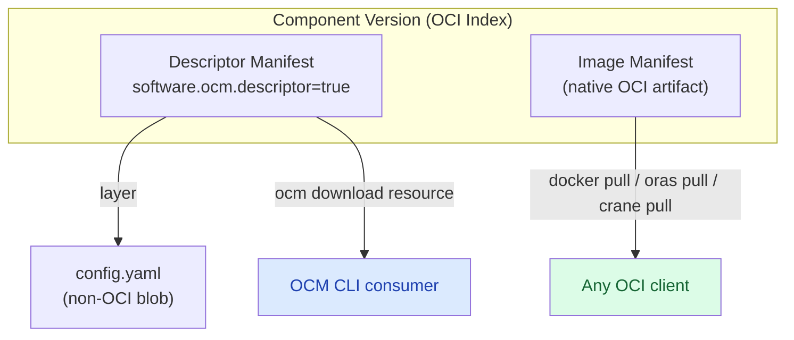


This guide continues from
[Add OCI Artifacts]().
It assumes you already built the component versions from that guide — an embedded
OCI image layout, an externally referenced image, and an ORAS-fetched layout — each
sitting in a local `./transport-archive` CTF. Complete it before running the steps
below.


With a component version built, transferring it with a local blob uploader internalizes
its OCI artifacts and maps them to native OCI manifests in the target registry. They
become pullable directly with standard OCI tooling like `docker pull`, `oras pull`, or
`crane` — no OCM CLI required.

OCM v2 makes this possible through its [OCI-compatible index representation](https://github.com/open-component-model/ocm-spec/blob/main/doc/04-extensions/03-storage-backends/oci.md#62-index-representation). When a component version is stored in an OCI registry, native OCI artifacts (images, Helm charts, OCI image layouts) stored as local blobs are mapped to proper OCI manifests within the component version's index. This means they can be accessed directly by digest using any OCI-compliant client.

## What You'll Learn

- Transfer a component version with a local blob uploader so external OCI image references are internalized as local blobs
- Access local blobs natively from an OCI registry by their `localReference` digest and media type
- Pull the artifact with `docker`, `oras`, and `crane` without the OCM CLI

**Estimated time:** ~15 minutes

## Prerequisites

- [OCM CLI installed]()
- [ORAS CLI](https://oras.land/docs/installation) and/or [crane](https://github.com/google/go-containerregistry/tree/main/cmd/crane) for native pulls
- [jq](https://jqlang.org/) installed (for inspecting JSON)
- The `./transport-archive` CTFs from [Add OCI Artifacts]()
- Access to an OCI registry (e.g. a local registry via `docker run -d -p 5001:5000 registry:2`)

## Tutorial





Starting from the component version that embeds an OCI image layout as a local blob,
transfer it to an OCI registry where it becomes natively accessible.





### Transfer to an OCI registry

Transfer the component version to an OCI registry. First, create a transfer configuration that copies all resources by value:

```yaml
cat > .ocmconfig << 'EOF'
type: generic.config.ocm.software/v1
configurations:
  - type: localblob.uploader.transfer.config.ocm.software/v1alpha1
EOF
```

The CLI automatically merges `.ocmconfig` from the current directory with your other OCM configuration (such as `$HOME/.ocmconfig`), so credentials and resolvers stay in effect. Passing a file with `--config` would replace that configuration instead.

```bash
ocm transfer cv \
  ./transport-archive//github.com/acme.org/native-oci-demo:1.0.0 \
  <your-registry>
```

Replace `<your-registry>` with your registry address (e.g. `http://localhost:5001` for a local HTTP registry, or `ghcr.io/my-org/ocm` for a remote HTTPS registry).


For local registries running without TLS, use the `http://` scheme prefix (e.g. `http://localhost:5001`). HTTPS registries work without a scheme prefix.


During transfer, OCM stores the OCI manifest and its layers as native OCI objects in the registry. The component version's index references the manifest directly.





### Access the image natively

After transfer, inspect the component version in the registry to find the image's digest:

```bash
ocm get cv <your-registry>//github.com/acme.org/native-oci-demo:1.0.0 -o yaml
```

Look for the `localReference` field in the resource's access specification — it contains the digest of the native OCI manifest:

```yaml
resources:
  - access:
      localReference: sha256:...
      mediaType: application/vnd.oci.image.manifest.v1+json
      type: LocalBlob/v1
    name: my-oci-artifact
    type: ociArtifact
```

You can pull the artifact natively using the `localReference` digest combined with the component version's repository path:

```bash
# Using ORAS
oras pull <your-registry>/component-descriptors/github.com/acme.org/native-oci-demo@sha256:...

# Using crane
crane pull <your-registry>/component-descriptors/github.com/acme.org/native-oci-demo@sha256:... image.tar
```


The repository path follows the pattern `<registry>/<subpath>/component-descriptors/<component-name>`. The digest from `localReference` addresses the manifest directly within the component version's OCI index.










Starting from the component version that references an external OCI image, transfer it
with a local blob uploader configuration to internalize the image as a local blob, and
then access it natively from the target registry.





### Transfer with a local blob uploader

Transfer the component to your target registry, copying all resources by value. Create the `.ocmconfig` if you have not already:

```yaml
cat > .ocmconfig << 'EOF'
type: generic.config.ocm.software/v1
configurations:
  - type: localblob.uploader.transfer.config.ocm.software/v1alpha1
EOF
```

```bash
ocm transfer cv \
  ./transport-archive//github.com/acme.org/transfer-demo:1.0.0 \
  <your-registry>
```


For local registries running without TLS, use the `http://` scheme prefix (e.g. `http://localhost:5001`). HTTPS registries work without a scheme prefix.


With the local blob uploader configuration, OCM:

1. Downloads the image from `ghcr.io/stefanprodan/podinfo:6.9.1`
2. Stores it as a local blob in the target component version
3. Maps it to a native OCI manifest in the component version's index
4. Updates the access specification with a `localReference` (digest) pointing to the native OCI manifest





### Inspect the transferred component

```bash
ocm get cv <your-registry>//github.com/acme.org/transfer-demo:1.0.0 -o yaml
```

After transfer with the local blob uploader, the access specification changes from an external reference to a local blob:

```yaml
resources:
  - access:
      localReference: sha256:...
      mediaType: application/vnd.oci.image.index.v1+json
      referenceName: stefanprodan/podinfo:6.9.1
      type: LocalBlob/v1
    name: app-image
    relation: external
    type: ociImage
    version: 1.0.0
```

Key observations:

- `access.type` changed from `ociArtifact` to `LocalBlob/v1` — the image is now embedded
- `localReference` contains the digest of the stored image manifest/index
- `mediaType` is `application/vnd.oci.image.index.v1+json` (or `application/vnd.oci.image.manifest.v1+json` for single-platform images)
- `referenceName` preserves the original image reference for traceability
- `relation` remains `external` — this indicates the resource was originally sourced externally, even though it is now stored locally





### Pull the image natively

Use the `localReference` digest to pull the image with standard OCI tooling. The image is stored within the component version's repository:

```bash
# Using docker
docker pull <your-registry>/component-descriptors/github.com/acme.org/transfer-demo@sha256:...

# Using crane
crane manifest <your-registry>/component-descriptors/github.com/acme.org/transfer-demo@sha256:...
```

The image is stored as a first-class OCI manifest in the registry. No OCM tooling is required to access it — any OCI-compliant client works.

You can also download through OCM:

```bash
ocm download resource <your-registry>//github.com/acme.org/transfer-demo:1.0.0 \
  --identity name=app-image \
  --output app-image-download
```









Starting from the component version that embeds an ORAS-fetched OCI image layout,
transfer it to a target registry and pull it natively.





### Transfer

```bash
cat > .ocmconfig << 'EOF'
type: generic.config.ocm.software/v1
configurations:
  - type: localblob.uploader.transfer.config.ocm.software/v1alpha1
EOF

ocm transfer cv \
  ./transport-archive//github.com/acme.org/fetched-oci-demo:1.0.0 \
  <your-registry>
```





### Inspect the transferred component version

After transfer, inspect the component version in the registry:

```bash
ocm get cv <your-registry>//github.com/acme.org/fetched-oci-demo:1.0.0 -o yaml
```

The resource access now shows a local blob reference:

```yaml
resources:
  - access:
      localReference: sha256:abc123...
      mediaType: application/vnd.oci.image.index.v1+json
      referenceName: stefanprodan/podinfo:6.9.1
      type: LocalBlob/v1
    name: app-image
    relation: external
    type: ociArtifact
    version: 1.0.0
```

Key observations:

- `localReference` contains the digest of the stored image manifest/index — this is the value you need for native access
- `mediaType` is `application/vnd.oci.image.index.v1+json` (multi-platform) or `application/vnd.oci.image.manifest.v1+json` (single-platform)
- `referenceName` preserves the original image reference for traceability





### Pull natively

Use the `localReference` digest from the previous step to pull the artifact with standard OCI tooling:

```bash
# Pull using the localReference digest
oras pull <your-registry>/component-descriptors/github.com/acme.org/fetched-oci-demo@sha256:abc123...
```

The image is stored as a first-class OCI manifest in the registry. No OCM tooling is required to access it — any OCI-compliant client works.









## How Native Access Works

Under the hood, OCM v2 stores component versions as [OCI Image Indexes](https://github.com/opencontainers/image-spec/blob/main/image-index.md). When a local blob has an OCI-native media type (image manifest, image index, or OCI image layout), it is stored as a separate OCI manifest referenced from the component version's index — not as an opaque layer.



This means:

- **Non-OCI blobs** (plain files, config data) are stored as layers in the descriptor manifest, accessed only through OCM tooling
- **Native OCI artifacts** (images, Helm charts) are stored as separate manifests in the index, accessible both through OCM and directly through any OCI client

## Check Your Understanding



- **`localReference`** is a content-addressable digest that identifies the blob within the component version's storage. It is **stable across transfers** — the same digest works regardless of which registry hosts the component, because it is derived from the blob content itself. It works with any OCM repository implementation (CTF archives, OCI registries). For native OCI artifacts stored in an OCI registry, you can access them directly using this digest combined with the component version's repository path.
- **`globalAccess`** is an optional, location-specific access specification that points to the artifact in a particular registry. It is **not set by default** — the `globalAccessPolicy` must be explicitly configured to enable it. Note that this reference **becomes invalid after mirroring** — when the component is transferred to a different registry, the `globalAccess` still points to the original registry. Always use `localReference` for stable, location-independent access.




By default, `globalAccess` is not populated. To opt in, use the two-step transfer workflow with a transfer specification:

1. Generate the transfer spec:

   ```bash
   ocm transfer cv --dry-run -o yaml \
     ./transport-archive//github.com/acme.org/native-oci-demo:1.0.0 \
     <your-registry> > spec.yaml
   ```

2. Edit `spec.yaml` and add `globalAccessPolicy: auto` to each `OCIAddLocalResource` node's `spec` field:

   ```yaml
   - type: OCIAddLocalResource/v1alpha1
     spec:
       globalAccessPolicy: auto
       # ... other fields ...
   ```

3. Execute the modified spec:

   ```bash
   ocm transfer cv --transfer-spec spec.yaml
   ```

This is an experimental feature carried over from OCM v1 for backwards compatibility. Its future availability is being evaluated by the community.

With `globalAccessPolicy: auto`, the descriptor looks like this after transfer:

```yaml
resources:
  - access:
      localReference: sha256:abc123...
      mediaType: application/vnd.oci.image.index.v1+json
      referenceName: stefanprodan/podinfo:6.9.1
      type: LocalBlob/v1
      globalAccess:
        imageReference: <your-registry>/component-descriptors/github.com/acme.org/native-oci-demo@sha256:abc123...
        type: ociArtifact
    name: app-image
    relation: external
    type: ociArtifact
    version: 1.0.0
```

The `globalAccess.imageReference` provides a direct pullable reference. Note that this reference may become stale if the component is transferred to another registry using tooling that does not update the `globalAccess` field.

Without `globalAccess`, you can still access native OCI artifacts directly using the `localReference` digest and the component version's repository path in the registry.



Yes. A local blob uploader configuration stores artifacts as local blobs within the component version. To upload them as standalone OCI artifacts in the target registry, add an OCI uploader entry before the local blob entry:

```yaml
type: generic.config.ocm.software/v1
configurations:
  - type: oci.uploader.transfer.config.ocm.software/v1alpha1
  - type: localblob.uploader.transfer.config.ocm.software/v1alpha1
```

With the local blob uploader, the artifact stays within the component version's index. With the OCI uploader, it is stored independently.

Both options make the artifact natively accessible in OCI registries. For details, see the [Transfer Configuration Reference]().


## Cleanup

Remove the tutorial artifacts:

```bash
rm -rf /tmp/ocm-native-oci /tmp/ocm-transfer-native /tmp/ocm-fetch-oci
```

## Next Steps

- [Transfer Components across an Air Gap]() — Transfer signed components through air-gapped environments
- [Download Resources]() — Extract resources from components
- [Upload OCI Images]() — Upload embedded images as standalone OCI artifacts in the target

## Related Documentation

- [Concept: Transfer and Transport]() — Understand resource handling during transfer
- [Reference: Input and Access Types]() — All supported resource types
- [OCM OCI Storage Spec: Index Representation](https://github.com/open-component-model/ocm-spec/blob/main/doc/04-extensions/03-storage-backends/oci.md#62-index-representation) — How component versions map to OCI indexes
