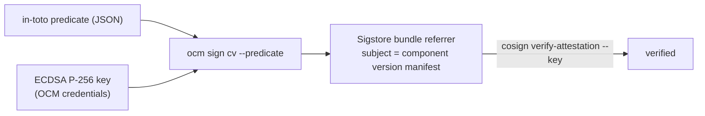

## Goal

Attach a **cosign-verifiable attestation** to a component version. `ocm sign component-version --predicate`
wraps an in-toto predicate you supply into a DSSE envelope, signs it with an ECDSA P-256 key, and stores it as an OCI
referrer of the component-version manifest — so third-party tooling like `cosign` can discover and verify it.

Unlike an OCM component-descriptor signature (see
[Sign a Component Version]()), this produces a
[Sigstore bundle](https://github.com/sigstore/protobuf-specs) that `cosign verify-attestation` understands directly.

## You'll end up with

- An in-toto/SLSA attestation attached to the component-version manifest as an OCI referrer
  (`artifactType: application/vnd.dev.sigstore.bundle.v0.3+json`)
- The attestation discoverable with `oras discover` and verifiable with `cosign verify-attestation --key`
- No new signature added to the component descriptor — the attestation lives entirely as a referrer

**Estimated time:** ~10 minutes

## How it works



The statement subject is bound to the component-version **manifest digest**, which `cosign` requires: it rejects an
attestation whose subject digest does not match the artifact being verified.

## Prerequisites

- [OCM CLI installed]()
- [`cosign`](https://github.com/sigstore/cosign#installation) (for verification)
- [`oras`](https://oras.land/docs/installation) (for discovery)
- An **ECDSA P-256** key pair. Generate one with OpenSSL:

  ```bash
  openssl ecparam -name prime256v1 -genkey -noout -out ec.key
  openssl pkcs8 -topk8 -nocrypt -in ec.key -out ec-private.pem   # PKCS#8 private key for OCM
  openssl ec -in ec.key -pubout -out ec-public.pem               # public key for cosign --key
  ```

  RSA and GPG keys are **not** supported for attestations; the DSSE/cosign format requires ECDSA (P-256 here).
- A registry that supports the [Referrers API](https://github.com/opencontainers/distribution-spec/blob/v1.1.0/spec.md#listing-referrers)
  (most modern registries; CTF archives use the referrers-tag fallback). Examples use `ghcr.io`.

## Configure the ECDSA signing key

The key is resolved from the OCM credential graph, keyed by an `ECDSACredentials` consumer identity whose
`signature` matches the `--signature` name (default `default`). Add to your `.ocmconfig`:

```yaml
type: generic.config.ocm.software/v1
configurations:
  - type: credentials.config.ocm.software/v1
    consumers:
      - identities:
          - type: ECDSACredentials
            signature: default
        credentials:
          - type: ECDSACredentials/v1
            privateKeyPEMFile: /path/to/ec-private.pem
```

You can also inline the key with `privateKeyPEM: |` instead of `privateKeyPEMFile`.

## Provide a predicate

The attestation carries an in-toto predicate you supply as JSON. Any predicate shape works; the default predicate
type is `https://slsa.dev/provenance/v0.2` (override with `--predicate-type`).


Inside a GitHub Actions workflow you can assemble a SLSA-style predicate from the runner's `GITHUB_*` context and
write it to a file, then hand it to `ocm sign`:

```yaml
- name: Build the SLSA predicate
  run: |
    cat > predicate.json <<EOF
    {
      "buildType": "https://github.com/slsa-framework/slsa-github-generator/container@v1",
      "builder": { "id": "${GITHUB_SERVER_URL}/${GITHUB_WORKFLOW_REF}" },
      "invocation": {
        "configSource": {
          "uri": "git+${GITHUB_SERVER_URL}/${GITHUB_REPOSITORY}@${GITHUB_REF}",
          "digest": { "sha1": "${GITHUB_SHA}" },
          "entryPoint": "${GITHUB_WORKFLOW}"
        }
      },
      "metadata": { "buildInvocationID": "${GITHUB_RUN_ID}-${GITHUB_RUN_ATTEMPT}" },
      "materials": [
        { "uri": "git+${GITHUB_SERVER_URL}/${GITHUB_REPOSITORY}@${GITHUB_REF}", "digest": { "sha1": "${GITHUB_SHA}" } }
      ]
    }
    EOF
```

For a full, non-forgeable SLSA provenance document you can instead use the
[slsa-github-generator](https://github.com/slsa-framework/slsa-github-generator) and pass its output as the predicate.


## Attest the component version




### Sign the attestation

```bash
ocm --config .ocmconfig sign component-version \
  ghcr.io/<your-org>//ocm.software/my-component:1.0.0 \
  --predicate predicate.json \
  --predicate-type https://slsa.dev/provenance/v0.2
```

OCM resolves the ECDSA key, builds and signs the DSSE envelope over your predicate, and pushes a Sigstore bundle
referrer whose subject is the component-version manifest. The component descriptor is left unchanged.




### Discover the attestation

```bash
REPO=ghcr.io/<your-org>/component-descriptors/ocm.software/my-component
DIGEST=$(oras resolve "$REPO:1.0.0")
oras discover "$REPO@$DIGEST" --artifact-type application/vnd.dev.sigstore.bundle.v0.3+json
```

You should see a referrer of type `application/vnd.dev.sigstore.bundle.v0.3+json`.




### Verify with cosign

`cosign verify-attestation` verifies the DSSE signature against your public key. Because the attestation is not
recorded in a transparency log, pass `--insecure-ignore-tlog` for offline, key-based verification:

```bash
cosign verify-attestation \
  --key ec-public.pem \
  --type https://slsa.dev/provenance/v0.2 \
  --insecure-ignore-tlog \
  "$REPO@$DIGEST"
```

<details>
<summary>You should see</summary>

```text
Verification for ...
  - The cosign claims were validated
  - The signatures were verified against the specified public key
```

</details>




## OCM signatures vs. cosign attestations

| | `ocm sign cv` (descriptor signature) | `ocm sign cv --predicate` (attestation) |
| --- | --- | --- |
| Stored as | `signatures[]` on the component descriptor | OCI referrer of the component-version manifest |
| Signs | the normalized component-descriptor digest | a DSSE envelope over your in-toto predicate |
| Keys | RSA or GPG | ECDSA P-256 only |
| Verified by | `ocm verify cv` | `cosign verify-attestation --key` (and `oras discover`) |

The two are independent and can coexist: sign the descriptor for OCM-native authenticity, and attach a cosign
attestation for external supply-chain tooling.

## Troubleshooting

| Symptom | Likely cause and fix |
| --- | --- |
| `no ECDSA private key found in credentials` | The credential consumer identity does not match, or the key path is wrong. Ensure the `ECDSACredentials` consumer `signature` matches `--signature` (default `default`) and `privateKeyPEMFile` points at a valid PKCS#8/SEC1 ECDSA P-256 key. |
| `only P-256 is supported` | The key is not ECDSA P-256. Regenerate with `openssl ecparam -name prime256v1`. |
| `target repository cannot store attestations` | The target is not an OCI repository. Attestations are supported on OCI registries and CTF archives. |
| `cosign`: `provided artifact digest does not match any digest in statement` | You verified against a different manifest than the one attested. Resolve the digest-pinned `component-descriptors/...` reference. |
| `cosign verify-attestation` wants a transparency-log entry | Pass `--insecure-ignore-tlog`: OCM attaches an unsigned-in-tlog, key-signed bundle for offline verification. |

## Related Documentation

- [How-To: Sign a Component Version]() — OCM-native descriptor signatures
- [How-To: Configure Signing Credentials]() — credential configuration patterns
- [Concept: Signing and Verification]() — how OCM establishes authenticity
