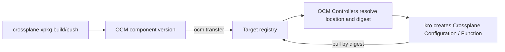

## Goal

Ship Crossplane packages (`.xpkg`) in an OCM component version, transfer them to the registry your clusters pull
from, and let the OCM Controllers and kro install them into Crossplane, pinned by digest.

## You'll end up with

- An OCM component version that holds a Crossplane Configuration package and the Function it depends on
- Both packages copied into your target registry (for example, Artifactory) by `ocm transfer`
- A kro `ResourceGraphDefinition` that installs the packages as Crossplane `Configuration` and `Function` objects,
  using the location and digest that the OCM Controllers resolve from the component version
- A composite resource that Crossplane renders with the installed packages

**Estimated time:** ~20 minutes

## How it works

A Crossplane package is an OCI image. Crossplane pulls it from a registry when you create a `Configuration`, `Function`,
or `Provider` object. OCM stores and transfers OCI images natively, so an `.xpkg` is a regular OCM resource with an
`OCIImage/v1` access. You don't need a conversion step or a custom resource type.



The component version is the single source of truth for which package versions belong together. After a transfer,
the OCM Controllers read the package locations from the component version in the target registry. Crossplane then pulls
each package from there by digest, never from the original source.

## Prerequisites

- [Controller environment]() with the OCM Controllers and kro installed. You don't need Flux or Argo CD.
- [Crossplane v2](https://docs.crossplane.io/latest/get-started/install/) installed in the same cluster:

  ```shell
  helm repo add crossplane-stable https://charts.crossplane.io/stable
  helm install crossplane crossplane-stable/crossplane \
    --namespace crossplane-system --create-namespace
  ```

- [Crossplane CLI](https://docs.crossplane.io/latest/cli/) installed, to build `.xpkg` files
- [OCM CLI]() installed
- An OCI registry that you can push to and that your cluster can pull from, with
  [credentials configured]() for the OCM CLI.
  The kubelet on your nodes must also reach this registry, because Function and Provider packages run as pods.
- `envsubst` installed (part of `gettext`)

## Set up the environment

```shell
# Where your team publishes .xpkg files today, for example an Artifactory OCI repository
export XPKG_REGISTRY=registry.example.com/crossplane
# The OCM repository your clusters read from; can be the same registry
export OCM_REPO=registry.example.com/ocm
```

## Steps




### Build and publish the Crossplane package

Skip this step if you already publish `.xpkg` files to a registry.

The example Configuration defines an `App` API that renders a `ConfigMap`. Its Composition calls
`function-patch-and-transform`, so the Function is a dependency of the Configuration.

```shell
mkdir -p /tmp/xpkg-ocm/package && cd /tmp/xpkg-ocm

cat > package/crossplane.yaml << 'EOF'
apiVersion: meta.pkg.crossplane.io/v1
kind: Configuration
metadata:
  name: configuration-app
spec:
  crossplane:
    version: ">=v2.0.0"
  dependsOn:
    - apiVersion: pkg.crossplane.io/v1
      kind: Function
      package: xpkg.crossplane.io/crossplane-contrib/function-patch-and-transform
      version: ">=v0.11.0"
EOF

cat > package/definition.yaml << 'EOF'
apiVersion: apiextensions.crossplane.io/v2
kind: CompositeResourceDefinition
metadata:
  name: apps.example.ocm.software
spec:
  group: example.ocm.software
  names:
    kind: App
    plural: apps
  scope: Namespaced
  versions:
    - name: v1alpha1
      served: true
      referenceable: true
      schema:
        openAPIV3Schema:
          type: object
          properties:
            spec:
              type: object
              properties:
                message:
                  type: string
              required:
                - message
EOF

cat > package/composition.yaml << 'EOF'
apiVersion: apiextensions.crossplane.io/v1
kind: Composition
metadata:
  name: apps.example.ocm.software
spec:
  compositeTypeRef:
    apiVersion: example.ocm.software/v1alpha1
    kind: App
  mode: Pipeline
  pipeline:
    - step: render-configmap
      functionRef:
        name: crossplane-contrib-function-patch-and-transform
      input:
        apiVersion: pt.fn.crossplane.io/v1beta1
        kind: Resources
        resources:
          - name: config
            base:
              apiVersion: v1
              kind: ConfigMap
              data: {}
            patches:
              - type: FromCompositeFieldPath
                fromFieldPath: spec.message
                toFieldPath: data.message
            readinessChecks:
              - type: None
EOF
```

Build the package and push it:

```shell
crossplane xpkg build --package-root=package --package-file=configuration-app.xpkg
crossplane xpkg push -f configuration-app.xpkg $XPKG_REGISTRY/configuration-app:v0.1.0
```




### Add the packages to a component version

Reference each package as a resource with `OCIImage/v1` access. Choose how to add the Configuration package:




Use this if your pipeline already pushes `.xpkg` files to a registry.

```shell
cat > component-constructor.yaml << EOF
components:
  - name: ocm.software/examples/crossplane-app
    version: 0.1.0
    provider:
      name: ocm.software
    resources:
      - name: configuration-app
        type: ociImage
        version: 0.1.0
        access:
          type: OCIImage/v1
          imageReference: $XPKG_REGISTRY/configuration-app:v0.1.0
      - name: function-patch-and-transform
        type: ociImage
        version: v0.11.0
        relation: external
        access:
          type: OCIImage/v1
          imageReference: xpkg.upbound.io/crossplane-contrib/function-patch-and-transform:v0.11.0
EOF
```




Use this to put a package into the component version without pushing it anywhere first.

`crossplane xpkg build` writes a Docker image tarball, but OCM embeds OCI image layouts. Convert the file with
[skopeo](https://github.com/containers/skopeo). The conversion switches to OCI media types, so the
embedded package gets a different digest than a pushed `.xpkg`.

```shell
skopeo copy docker-archive:configuration-app.xpkg oci-archive:configuration-app.tar
```

```shell
cat > component-constructor.yaml << EOF
components:
  - name: ocm.software/examples/crossplane-app
    version: 0.1.0
    provider:
      name: ocm.software
    resources:
      - name: configuration-app
        type: ociImage
        version: 0.1.0
        input:
          type: File/v1
          path: ./configuration-app.tar
          mediaType: application/vnd.ocm.software.oci.layout.v1+tar
      - name: function-patch-and-transform
        type: ociImage
        version: v0.11.0
        relation: external
        access:
          type: OCIImage/v1
          imageReference: xpkg.upbound.io/crossplane-contrib/function-patch-and-transform:v0.11.0
EOF
```




The resource `type` is free-form. This guide uses `ociImage` because an `.xpkg` is an OCI image. Use a dedicated type
such as `crossplanePackage` if downstream tooling needs to tell packages apart from container images.
Provider packages work the same way as the Function here.


`xpkg.crossplane.io` answers the OCI referrers API with `NAME_UNKNOWN`. OCM, like ORAS, treats that as an error, so
`ocm transfer` can't copy packages from there. The example references the same package through `xpkg.upbound.io`,
which serves the identical digest. To keep a package from `xpkg.crossplane.io` by reference instead of copying it, see
[Troubleshooting](#referrers-name-unknown).


Build the component version into a local CTF archive:

```shell
ocm add cv
```

<details>
<summary>You should see this output</summary>

```text
 COMPONENT                            │ VERSION │ PROVIDER
──────────────────────────────────────┼─────────┼──────────────
 ocm.software/examples/crossplane-app │ 0.1.0   │ ocm.software
```

</details>

OCM resolves each tag and pins the package digest in the component descriptor:

```shell
ocm get cv transport-archive//ocm.software/examples/crossplane-app:0.1.0 -o yaml
```

<details>
<summary>Excerpt</summary>

```yaml
resources:
  - access:
      imageReference: xpkg.upbound.io/crossplane-contrib/function-patch-and-transform:v0.11.0@sha256:677ad7d06eab2da219c9f28a7f6393fd74e5cfe445b98e324a23736163fb4e99
      type: OCIImage/v1
    digest:
      hashAlgorithm: SHA-256
      normalisationAlgorithm: ociArtifactDigest/v1
      value: 677ad7d06eab2da219c9f28a7f6393fd74e5cfe445b98e324a23736163fb4e99
    name: function-patch-and-transform
    type: ociImage
    version: v0.11.0
```

</details>




### Transfer the component version to your registry

Copy the component version and its packages to `$OCM_REPO`. Choose where the packages land:




Each package becomes a normal image in the target registry. You can browse it in your registry UI, just like the
`.xpkg` files you publish today.

```shell
cat > .ocmconfig << 'EOF'
type: generic.config.ocm.software/v1
configurations:
  - type: oci.uploader.transfer.config.ocm.software/v1alpha1
  - type: localblob.uploader.transfer.config.ocm.software/v1alpha1
EOF

ocm transfer cv transport-archive//ocm.software/examples/crossplane-app:0.1.0 $OCM_REPO
```

The descriptor in the target now points at the relocated images:

```yaml
resources:
  - access:
      imageReference: registry.example.com/ocm/crossplane/configuration-app:v0.1.0
      type: ociArtifact/v1
    name: configuration-app
  - access:
      imageReference: registry.example.com/ocm/crossplane-contrib/function-patch-and-transform:v0.11.0
      type: ociArtifact/v1
    name: function-patch-and-transform
```




The packages are stored inside the component version's OCI index, so the component version is self-contained. This
fits air-gapped setups: transfer to a CTF archive, carry it across, and import it. See
[Transfer Components Across an Air Gap]().

```shell
cat > .ocmconfig << 'EOF'
type: generic.config.ocm.software/v1
configurations:
  - type: localblob.uploader.transfer.config.ocm.software/v1alpha1
EOF

ocm transfer cv transport-archive//ocm.software/examples/crossplane-app:0.1.0 $OCM_REPO
```

The descriptor in the target holds local blobs. Each one is a native OCI manifest that you can pull as
`$OCM_REPO/component-descriptors/<component>@<localReference>`:

```yaml
resources:
  - access:
      localReference: sha256:677ad7d06eab2da219c9f28a7f6393fd74e5cfe445b98e324a23736163fb4e99
      mediaType: application/vnd.oci.image.index.v1+json
      referenceName: crossplane-contrib/function-patch-and-transform:v0.11.0
      type: LocalBlob/v1
    name: function-patch-and-transform
```




The CLI merges `.ocmconfig` from the current directory with your other OCM configuration, so your registry
credentials stay in effect. For details on uploaders, see
[Migrate from --upload-as to Uploader Configurations]().




### Create the ResourceGraphDefinition

The ResourceGraphDefinition (RGD) chains the OCM objects (`Repository`, `Component`, `Resource`) to the
Crossplane package objects (`Function`, `Configuration`):

```shell
cat > rgd.yaml << 'EOF'
apiVersion: kro.run/v1alpha1
kind: ResourceGraphDefinition
metadata:
  name: crossplane-app
spec:
  schema:
    apiVersion: v1alpha1
    kind: CrossplaneApp
    spec:
      # The component version to install. Changing it upgrades the Crossplane packages.
      version: string | default="0.1.0"
  resources:
    - id: repository
      readyWhen:
        - ${repository.status.conditions.exists(c, c.type == 'Ready' && c.status == 'True')}
      template:
        apiVersion: delivery.ocm.software/v1alpha1
        kind: Repository
        metadata:
          name: crossplane-app
        spec:
          repositorySpec:
            baseUrl: $OCM_REPO
            type: OCIRegistry
          interval: 1m
          # Required if the OCM repository needs credentials:
          # ocmConfig:
          #   - kind: Secret
          #     name: ocm-registry-credentials
    - id: component
      readyWhen:
        - ${component.status.conditions.exists(c, c.type == 'Ready' && c.status == 'True')}
      template:
        apiVersion: delivery.ocm.software/v1alpha1
        kind: Component
        metadata:
          name: crossplane-app
        spec:
          repositoryRef:
            name: ${repository.metadata.name}
          component: ocm.software/examples/crossplane-app
          semver: ${schema.spec.version}
          interval: 1m
    # One Resource per package. The CEL expression builds a digest-pinned package reference from the
    # resolved location (standalone image or local blob) and the digest recorded in the component version.
    - id: functionPackage
      readyWhen:
        - ${functionPackage.status.conditions.exists(c, c.type == 'Ready' && c.status == 'True')}
      template:
        apiVersion: delivery.ocm.software/v1alpha1
        kind: Resource
        metadata:
          name: function-patch-and-transform
        spec:
          componentRef:
            name: ${component.metadata.name}
          resource:
            byReference:
              resource:
                name: function-patch-and-transform
          additionalStatusFields:
            package: >-
              resource.access.toOCI().registry + "/" + resource.access.toOCI().repository
              + "@sha256:" + resource.digest.value
    - id: configurationPackage
      readyWhen:
        - ${configurationPackage.status.conditions.exists(c, c.type == 'Ready' && c.status == 'True')}
      template:
        apiVersion: delivery.ocm.software/v1alpha1
        kind: Resource
        metadata:
          name: configuration-app
        spec:
          componentRef:
            name: ${component.metadata.name}
          resource:
            byReference:
              resource:
                name: configuration-app
          additionalStatusFields:
            package: >-
              resource.access.toOCI().registry + "/" + resource.access.toOCI().repository
              + "@sha256:" + resource.digest.value
    # "function" is a reserved kro identifier, hence the prefixed IDs.
    - id: crossplaneFunction
      readyWhen:
        - ${crossplaneFunction.status.conditions.exists(c, c.type == 'Healthy' && c.status == 'True')}
      template:
        apiVersion: pkg.crossplane.io/v1
        kind: Function
        metadata:
          # Must match functionRef.name in the Composition.
          name: crossplane-contrib-function-patch-and-transform
        spec:
          package: ${functionPackage.status.additional.package}
          # Required if the target registry needs credentials:
          # packagePullSecrets:
          #   - name: xpkg-pull-secret
    - id: crossplaneConfiguration
      readyWhen:
        - ${crossplaneConfiguration.status.conditions.exists(c, c.type == 'Healthy' && c.status == 'True')}
      template:
        apiVersion: pkg.crossplane.io/v1
        kind: Configuration
        metadata:
          name: configuration-app
        spec:
          package: ${configurationPackage.status.additional.package}
          # Dependencies come from the component version, not from Crossplane's resolver.
          skipDependencyResolution: true
          # packagePullSecrets:
          #   - name: xpkg-pull-secret
EOF
```

Key points:

- `resource.access.toOCI()` returns the registry and repository of the package wherever the transfer put it. For a
  local blob it derives them from the `Repository` base URL. Appending the resource digest from the component
  descriptor pins the package even when the relocated reference only carries a tag.
- `skipDependencyResolution: true` stops Crossplane from pulling the Function from the registry named in
  `crossplane.yaml`. The RGD installs the Function from the component version instead.
- The `Function` name must match `functionRef.name` in the Composition. `crossplane-contrib-function-patch-and-transform`
  is also the name that Crossplane's dependency resolver would generate.

Apply it:

```shell
envsubst < rgd.yaml | kubectl apply -f -
kubectl get rgd crossplane-app
```

<details>
<summary>You should see this output</summary>

```text
NAME             APIVERSION   KIND            STATE    READY   AGE
crossplane-app   v1alpha1     CrossplaneApp   Active   True    8s
```

</details>


The default kro installation from the setup guide can create any kind. If you run kro with least-privilege RBAC, grant
its `ServiceAccount` access to `delivery.ocm.software` `resources`, `repositories`, and `components`, and to
`pkg.crossplane.io` `functions` and `configurations`, as described in
[Configure Custom RBAC]().





### Install the packages

```shell
cat > instance.yaml << 'EOF'
apiVersion: kro.run/v1alpha1
kind: CrossplaneApp
metadata:
  name: crossplane-app
spec:
  version: 0.1.0
EOF

kubectl apply -f instance.yaml
kubectl get crossplaneapp crossplane-app -w
```

<details>
<summary>You should see this output</summary>

```text
NAME             STATE    READY   AGE
crossplane-app   ACTIVE   True    2m
```

</details>

Check that Crossplane installed both packages from the target registry:

```shell
kubectl get functions.pkg.crossplane.io,configurations.pkg.crossplane.io
```

<details>
<summary>You should see this output (standalone OCI images)</summary>

```text
NAME                                                                         INSTALLED   HEALTHY   PACKAGE
function.pkg.crossplane.io/crossplane-contrib-function-patch-and-transform   True        True      registry.example.com/ocm/crossplane-contrib/function-patch-and-transform@sha256:677ad7d0...

NAME                                                INSTALLED   HEALTHY   PACKAGE
configuration.pkg.crossplane.io/configuration-app   True        True      registry.example.com/ocm/crossplane/configuration-app@sha256:5d7a04b0...
```

With embedded packages, `PACKAGE` reads
`registry.example.com/ocm/component-descriptors/ocm.software/examples/crossplane-app@sha256:...`.

</details>




### Use the installed API

Create a composite resource from the `App` API that the Configuration installed:

```shell
cat << 'EOF' | kubectl apply -f -
apiVersion: example.ocm.software/v1alpha1
kind: App
metadata:
  name: hello
  namespace: default
spec:
  message: "Installed from an OCM component version"
EOF

kubectl get app hello -n default
kubectl get configmap -n default -l crossplane.io/composite=hello \
  -o jsonpath='{.items[0].data.message}'
```

<details>
<summary>You should see this output</summary>

```text
NAME    SYNCED   READY   COMPOSITION                 AGE
hello   True     True    apps.example.ocm.software   15s
Installed from an OCM component version
```

</details>




## Upgrade the packages

Publish a new component version with the new package versions, transfer it, and point the instance at it:

```shell
kubectl patch crossplaneapp crossplane-app --type merge -p '{"spec":{"version":"0.2.0"}}'
```

The OCM Controllers resolve the new component version, kro updates `spec.package` on the `Function` and
`Configuration` objects, and Crossplane rolls out the new package revisions.

## Use private registries

Artifactory and most other production registries need credentials in two places:

- **OCM Controllers** read the component version. Reference a credentials `Secret` with `ocmConfig` on the
  `Repository`. The `Component` and `Resource` objects inherit it. See
  [Configure Credentials for OCM Controllers]().
- **Crossplane** pulls the packages, and the kubelet pulls the Function and Provider runtime images. Create a
  `docker-registry` secret in Crossplane's namespace and list it in `packagePullSecrets`. Crossplane passes it on to
  the runtime Deployments:

  ```shell
  kubectl create secret docker-registry xpkg-pull-secret \
    --namespace crossplane-system \
    --docker-server=registry.example.com \
    --docker-username=<user> \
    --docker-password=<token>
  ```

  Then uncomment `packagePullSecrets` in the RGD. Instead of setting secrets per package, you can attach the secret to
  every package under a registry prefix with a Crossplane
  [ImageConfig](https://docs.crossplane.io/latest/packages/image-configs/) (`spec.registry.authentication.pullSecretRef`).

## Alternative: keep Crossplane's dependency resolution

If you prefer that Crossplane resolves `dependsOn` itself, transfer with the standalone OCI images option and redirect
the dependency registry to the target with an `ImageConfig`. The OCI uploader keeps the source repository path, so
`xpkg.crossplane.io/crossplane-contrib/function-patch-and-transform` lands at
`$OCM_REPO/crossplane-contrib/function-patch-and-transform`:

```yaml
apiVersion: pkg.crossplane.io/v1beta1
kind: ImageConfig
metadata:
  name: relocate-to-ocm-target
spec:
  matchImages:
    - type: Prefix
      prefix: xpkg.crossplane.io/
  rewriteImage:
    prefix: registry.example.com/ocm/
```

Drop the `Function` and `skipDependencyResolution` from the RGD. Crossplane then installs the Function from the
rewritten location (`status.resolvedPackage` on the Function shows it). The trade-off: Crossplane picks the dependency
version from the constraint in `crossplane.yaml`, not from the component version, so the digest isn't pinned by OCM.

## Troubleshooting

### Symptom: `FindPredecessors ... referrers ... name unknown` {#referrers-name-unknown}

The full error looks like:
`failed to perform "FindPredecessors" on source: GET "https://xpkg.crossplane.io/v2/.../referrers/sha256:...": response status code 404: name unknown`.

**Cause:** The source registry rejects the OCI referrers API request with `NAME_UNKNOWN` instead of signalling that it
doesn't support the API. `xpkg.crossplane.io` behaves this way.

**Fix:** Reference the package through a registry that serves the same digest, such as `xpkg.upbound.io`. Or keep that
resource by reference with a `reference` uploader entry before the catch-all:

```yaml
- type: reference.uploader.transfer.config.ocm.software/v1alpha1
  match: resource.name == "function-patch-and-transform"
```

The resource then keeps its `xpkg.crossplane.io` reference, and your cluster must be able to pull from there.

### Symptom: Configuration is `Healthy=False` with missing dependencies

**Cause:** Crossplane tried to resolve `dependsOn` itself, or the `Function` name doesn't match `functionRef.name` in the
Composition.

**Fix:** Set `skipDependencyResolution: true` on the `Configuration` and name the `Function` exactly as the Composition
references it.

### Symptom: Function pod in `ImagePullBackOff`

**Cause:** Crossplane fetched the package, but the kubelet can't pull the same image to run the Function. This happens
when the nodes have no route or no credentials for the target registry.

**Fix:** Add `packagePullSecrets` to the `Function` (see [Use private registries](#use-private-registries)), and make sure
the nodes can reach and trust the registry.

### Symptom: `id function is a reserved keyword in KRO`

**Cause:** kro reserves some identifiers, `function` among them.

**Fix:** Use a different resource `id` in the RGD, for example `crossplaneFunction`.

## Cleanup

```shell
kubectl delete app hello -n default
kubectl delete -f instance.yaml
envsubst < rgd.yaml | kubectl delete -f -
rm -rf /tmp/xpkg-ocm
```

Deleting the instance removes the `Function` and `Configuration` objects, and Crossplane uninstalls the packages.

## Next steps

- [How-to: Transfer Components Across an Air Gap]() - Move the component version and its packages into a disconnected registry
- [How-to: Verify Component Versions with the Controller]() - Check signatures before kro installs anything
- [Tutorial: Deploy a Helm Chart (with Bootstrap)]() - Ship the RGD itself in the component version and apply it with a `Deployer`

## Related documentation

- [Concept: OCM Controllers]() - How `Repository`, `Component`, and `Resource` resolve artifacts
- [Concept: Transfer and Transport]() - How OCM copies resources between repositories
- [Tutorial: Working with OCI]() - Embed OCI image layouts and access them natively
- [Crossplane: Configurations](https://docs.crossplane.io/latest/packages/configurations/) and [Functions](https://docs.crossplane.io/latest/packages/functions/)
