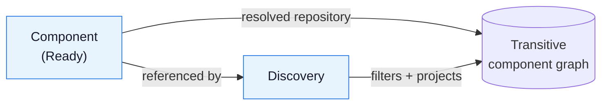

## Goal

Use a `Discovery` resource to resolve the transitive component graph of a
`Component`, filter it with selectors, and publish either the filtered raw
descriptors or projected free-form records into the `Discovery` status.

## You'll end up with

- A `Discovery` resource that watches a `Component` and publishes a filtered
  view of its reference graph in `status.components` or `status.extracted`.

**Estimated time:** ~10 minutes

## Prerequisites

- [Controller environment]() set up
- A `Ready` [Component]()
  in the same namespace whose component version references other components

## What Discovery does

A `Discovery` references a `Component` in the same namespace via
`spec.componentRef.name`. When that `Component` is `Ready`, the controller:

1. Reads the resolved repository from the `Component`'s
   `status.component.repositorySpec`. Descriptor `repositoryContexts` and
   configured repository redirects are ignored during traversal.
2. Resolves the **entire** reachable component graph from that repository before
   filtering or publishing anything.
3. Applies the reference, component, and resource selectors.
4. Sorts descriptors lexicographically by `(component.name, component.version)`.
5. Publishes filtered raw v2 descriptors in `status.components`, or, if
   `spec.extract` is set, projected records in `status.extracted`.




The controller resolves the complete graph even when your selectors target an
exact identity. The first resolution failure cancels the remaining work: the
last successful payload is retained and the `Ready` condition is set to `False`
with reason `ResolutionFailed`. There is no partial resolution and no
identity-based short-circuiting.

`Component` readiness does **not** guarantee that the whole graph is reachable —
the `Component` controller only fetches (and optionally verifies) the root
descriptor.


## Steps




### Publish the filtered descriptors

Create a `Discovery` that keeps every component in the graph carrying a matching
label. Without `spec.extract`, the filtered raw v2 descriptors are published in
`status.components`.

```bash
cat <<EOF > discovery.yaml
apiVersion: delivery.ocm.software/v1alpha1
kind: Discovery
metadata:
  name: platform-components
  namespace: default
spec:
  componentRef:
    name: releasechannel
  componentSelector:
    matchLabels:
      tier: platform
EOF
```

```bash
kubectl apply -f discovery.yaml
```





### Confirm the Discovery is ready

```bash
kubectl get discovery platform-components -o wide
```

Check that the graph was resolved and the observed generation matches:

```bash
kubectl get discovery platform-components -o jsonpath='{.status.conditions[?(@.type=="Ready")].status} {.status.observedGeneration} {.metadata.generation}{"\n"}'
```

Consumers must check **both** that `Ready` is `True` **and** that
`status.observedGeneration == metadata.generation`. Retained status is not
necessarily current — see [Status semantics](#status-semantics).





### Project the graph into records

To publish free-form records instead of raw descriptors, add `spec.extract`.
Each extraction mode returns a **list of objects**. Set exactly one of
`byResources`, `byComponents`, or `expression`.

```bash
cat <<EOF > discovery.yaml
apiVersion: delivery.ocm.software/v1alpha1
kind: Discovery
metadata:
  name: flux-images
  namespace: default
spec:
  componentRef:
    name: releasechannel
  componentSelector:
    matchLabels:
      tier: platform
  resourceSelector:
    expression: identity.name in ["flux", "image-automation-controller"]
  extract:
    byResources:
      imageRef: resource.access.imageReference
      resourceName: resource.name
      componentName: component.name
      componentVersion: component.version
EOF
```

```bash
kubectl apply -f discovery.yaml
```

The projected records appear in `status.extracted`:

```bash
kubectl get discovery flux-images -o jsonpath='{.status.extracted}' | jq
```




## Selectors

`spec.referenceSelector`, `spec.componentSelector`, and `spec.resourceSelector`
are all optional `Selector` objects. A `Selector` has three clauses, all ANDed
together. A nil or empty selector matches everything.

- **`matchIdentity`** — Matches elements whose identity contains all specified
  key-value pairs. Keys must be present, including comparisons against an empty
  value.
- **`matchLabels`** — Matches elements carrying labels with the specified
  **string** values. Non-string label values are matched via `expression` only.
- **`expression`** — A CEL expression evaluated for each element; it must
  evaluate to a boolean. An empty expression is a no-op.

Selector CEL bindings:

- `identity` — the element identity, a map of string to string.
- `labels` — a map from label name to the decoded JSON value of the label.

The `referenceSelector` scans the references of **all** resolved descriptors and
keeps each target with at least one matching incoming reference. A nonempty
selector excludes the root component; an empty (or unset) selector preserves it.
The `componentSelector` then filters the surviving components, and the
`resourceSelector` filters each surviving component's resources. Components with
zero surviving resources are kept.

### semverCheck

Selector and extraction expressions can call `semverCheck(version, constraint)`,
which returns a boolean using SemVer semantics (SemVer applies only to
`semverCheck`; graph ordering is lexicographic):

```yaml
componentSelector:
  expression: semverCheck(identity.version, ">=2.7.0, <2.10.0")
```

## Extraction

Set exactly one extraction mode under `spec.extract`. `extract: {}` is invalid.

- **`byResources`** (bindings `component`, `resource`) — Each map value is a CEL
  expression evaluated once per surviving `(component, resource)` pair.
- **`byComponents`** (binding `component`) — Each map value is a CEL expression
  evaluated once per surviving component.
- **`expression`** (binding `components`) — A single CEL expression evaluated
  once over the complete filtered descriptor list; must return a list of objects.

Notes:

- `byResources` and `byComponents` map values use v2 JSON field names (for
  example `component.name`, `resource.access.imageReference`). An explicitly
  empty map (`byResources: {}`) emits one empty record per iteration.
- The whole-`expression` mode binds full v2 descriptors (for example
  `components[0].component.name`, `components[0].component.componentReferences`) and is
  strict: it must produce objects with string keys.
- Map-mode missing field access is not an error — the field is omitted from the
  record, and the per-iteration record is kept even if all its fields disappear.
- All modes return a list of objects. Anything else fails with `ExtractFailed`.

### Absent, null, and missing: three different outcomes

A missing access (a map key that is not there, an attribute that isn't there,
an out-of-range list index) is never an error. In `byResources` and
`byComponents` the field is omitted. Within a selector, it simply doesn't match.

**A field that is present but `null`.** `descriptor/v2` has no `omitempty` on
`resources`, `sources` or `references`, so a component with none of them
serializes the field as `null` rather than omitting it.

For example:

```yaml
# `Stalls` the Discovery.
byComponents:
  refs: size(component.componentReferences)
```

`size(null)` is not a missing key, it is `no such overload`, which is an
`ExtractFailed`. 

Do this instead:

```yaml
byComponents:
  # single quotes are required
  refs: 'component.componentReferences == null ? 0 : size(component.componentReferences)'
```

**A missing access inside `expression` mode.** Unlike the map modes, whole-list
extraction is strict. The same typo that omits a field under
`byComponents` _fails_ the whole Discovery here.

Each optional read MUST be checked first:

```yaml
extract:
  expression: |
    components.map(c, {
      "name": c.component.name,
      "refs": has(c.component.componentReferences) && c.component.componentReferences != null
        ? size(c.component.componentReferences) : 0,
    })
```

`has()` -> "is the key there at all", then `!= null` -> "is it there but empty". A key that is
present with a `null` value passes `has()`.

**An expression returning `null` or `optional.none()`.** This is not a `missing
access` at all: the key is written into the record with an explicit `null` value
rather than being omitted.

## Configuration and repository scope

Discovery uses the shared OCM configuration propagation of the controller chain:

- **No `spec.ocmConfig`:** inherit only parent (`Component`) configuration
  entries marked `Propagate`.
- **Explicit `spec.ocmConfig`:** resolve those entries instead of the implicit
  inheritance.

The effective configuration is published in `status.effectiveOCMConfig` and used
uniformly for the root and all transitive fetches. Traversal uses only the
`Component`'s resolved `repositorySpec`.

## Status semantics

The controller publishes at most one of `status.components` or
`status.extracted`; a CEL validation rule rejects both being set. Presence is
meaningful:

- An **uncomputed** field is **absent**.
- A **selected but empty** result is an empty list (`[]`), never omitted or null.

On success, including when nothing matches, the controller sets `Ready=True`,
removes `Stalled`/`Reconciling`, and advances `status.observedGeneration`. The
`Ready` reason distinguishes the empty cases:

- **`Succeeded`** — The graph was resolved and filtered; results were published.
- **`NoReferencesMatched`** — The reference selector matched no references
  (`components: []` / `extracted: []`).
- **`NoComponentsMatched`** — The component selector matched no components.

On failure, the controller **retains the last successful payload**, even if it
belongs to the previous output mode, and updates only the failure conditions.

Failures are surfaced as is:

- **`ResolutionFailed`** (`Ready=False`): The component graph could not be
  resolved: repository, auth or network failure, or a component version that is
  not available. **Retried with backoff**, since the cause is usually transient
  and a failure below the root produces no watch event to recover from.
- **`SelectorFailed`** (`Ready=False`, `Stalled=True`): Selector compilation,
  evaluation or type error.
- **`ExtractFailed`** (`Ready=False`, `Stalled=True`): Extraction compilation,
  evaluation or output-type error.
- **`PayloadTooLarge`** (`Ready=False`, `Stalled=True`): The computed payload
  exceeds the 1MiB size limit; refine the selectors or extraction. The size is
  checked before writing, so the oversized candidate never reaches the API
  server and the persisted payload is retained.


Because failures retain the last successful payload, `status.components` /
`status.extracted` may not reflect the current spec. Always gate consumption on
`Ready=True` **and** `status.observedGeneration == metadata.generation`. A
suspended object never advances its observed generation solely because it
retains an old `Ready` condition.


## Scheduling

Discovery is watch-driven and watches exactly two things: its own generation,
and the referenced `Component`'s resolved info, effective config, readiness and
termination. Configuration sources are not watched, so rotating a credential
does not by itself trigger a re-discovery.

There is no interval. Every input that can change the _graph_ is either watched
or version-pinned: references resolve by version, so the graph cannot change
without the `Component`'s resolved version changing, which is watched.

Configuration is the exception, and deliberately so: credentials decide whether
the graph can be fetched, not what it contains. Combined with the absence of
retries, that means a Discovery that failed on credentials stays failed until
its spec changes or its `Component` moves. Fixing the `Secret` alone will not
revive it.

`status.observedComponentDigest` is used to check if another walk is necessary.
If the digest is the same for the root component as observed last time, we don't
need to re-walk the entire graph. This field is only set if ALL references have
a digest field for the root component since a missing digest breaks the chain
of trust. This is not considered if there is an observed generation update
of the Discovery object itself. That will always result in a full graph walk.

Suspended, deleting, and terminally failed (`Stalled=True`) objects do not
schedule periodic work.

## Deletion protection

A referencing `Discovery` blocks deletion of its `Component`, the same way a
referencing `Resource` does. Deleting or retargeting the `Discovery` releases the
old `Component`. Discovery creates no external resources, so it carries no
finalizer of its own and sets no owner reference on the `Component`.

## Scope and non-goals

Supported:

- Full traversal of the reachable graph from the `Component`'s resolved
  repository, with fail-fast on the first resolution failure.
- Reference, component, and resource selectors with identity, label, and CEL
  clauses, plus `semverCheck`.
- Raw descriptor publication or CEL projection into free-form records.

Not supported:

- Partial resolution, `UnresolvedReference`, `status.unresolved`, or
  `PartiallyResolved`.
- Identity-based short-circuiting of the traversal.
- Artifact/resource downloads.
- Signature-verification guarantees for the filtered descriptors. Filtered
  descriptors are **not** signature-verification inputs.
- Multi-root discovery.

## Next Steps

- [Verify Component Versions in the Controller]() -
  Verify component version signatures on reconciliation

## Related Documentation

- [Concept: Kubernetes Controllers]() -
  How Discovery fits alongside the reconciliation chain
- [Reference: Discovery CRD]() -
  Full field reference for the Discovery resource
- [How-To: Configure Credentials for OCM Controllers]() -
  Set up registry credentials for the controller
