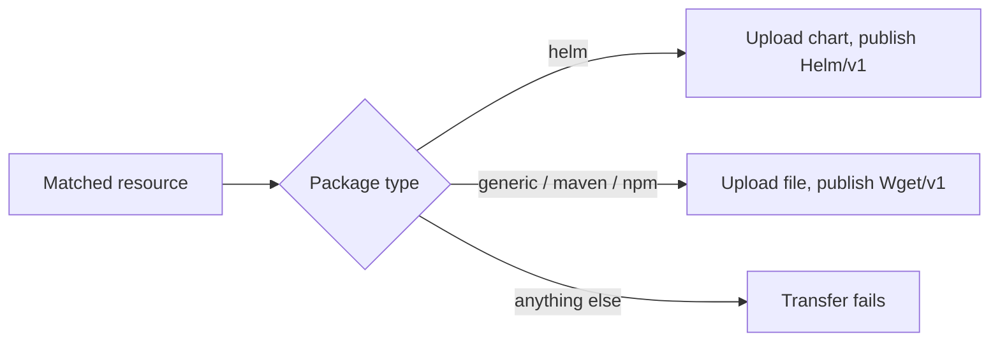

## Goal

Transfer a component version and upload its resources into JFrog Artifactory
repositories, so that consumers fetch them with their usual tools (`helm`, `mvn`,
`npm`, `curl`).

## You'll end up with

- Resources stored in Artifactory repositories of the right package type
- A transferred component version whose resources point at those repositories
  (`Helm/v1` for charts, `Wget/v1` for files)

**Estimated time:** ~15 minutes

## How the Artifactory uploader works

The
[`artifactory.uploader.transfer.config.ocm.software/v1alpha1`]()
uploader routes the resources it matches to one repository. At upload time it reads
the repository's package type from `GET <url>/artifactory/api/repositories/<repository>`
and picks the upload method for it:



| Repository type | Uploaded content                     | Published access                          |
|-----------------|--------------------------------------|-------------------------------------------|
| `helm`          | The Helm chart found in the resource | `Helm/v1` (`helmRepository`, `helmChart`) |
| `generic`       | The resource content as is           | `Wget/v1` on the stored file              |
| `maven`         | The resource content as is           | `Wget/v1` on the stored file              |
| `npm`           | The npm package tarball, as is       | `Wget/v1` on the stored tarball           |

Every other package type fails the transfer before anything is uploaded. See
[Other repository types](#other-repository-types) for alternatives.

## Prerequisites

- [OCM CLI]() installed
- A component version in a CTF or OCI repository
- An Artifactory **local** (or federated) repository
- A user that may deploy into the repository **and read its configuration**

## Configure credentials

The uploader resolves credentials for the `HelmChartRepository` identity of
`<url>/artifactory/api/helm/<repository>`, falling back to the `Wget` identity of
`<url>/artifactory/<repository>`. A `Wget` consumer without a path covers every
repository on the server:

```yaml
type: generic.config.ocm.software/v1
configurations:
  - type: credentials.config.ocm.software
    consumers:
      - identity:
          type: Wget
          hostname: common.repositories.cloud.sap
          scheme: https
        credentials:
          - type: WgetCredentials/v1
            identityToken: <ARTIFACTORY_IDENTITY_TOKEN>
```


`hostname` is the bare host name. A value such as `https://common.repositories.cloud.sap`
matches no request, so the upload is sent without credentials and fails with `401`.


## Upload to Artifactory

All examples below go into the same configuration file as the credentials.
Resources are matched by their access type **in the source component version**,
for example `localBlob` for resources added from files.

### Helm charts

Point the uploader at a Helm repository:

```yaml
  - type: artifactory.uploader.transfer.config.ocm.software/v1alpha1
    match:
      accessType: localBlob
      name: chart
    url: https://common.repositories.cloud.sap
    repository: open-component-model-helm-test
```

```bash
ocm transfer cv --config config.yaml ctf::./src//ocm.software/demo:1.0.0 ctf::./target
```

The chart is stored under `<component>/<component version>/<resource>-<resource version>.tgz`
and published with the chart name and version Artifactory read from it:

```yaml
access:
  type: Helm/v1
  helmRepository: https://common.repositories.cloud.sap/artifactory/api/helm/open-component-model-helm-test
  helmChart: mychart:0.1.0
```

- The repository must not enforce chart name and version in file names (*Helm
  Enforce Layout*): the file name comes from the OCM resource, not from the chart.
- A second transfer uploads nothing: the uploader logs
  `reused helm chart content already stored in the helm repository`.

### Maven artifacts

Maven resolves an artifact from its Maven coordinates, so store each file under the
Maven layout `<group path>/<artifactId>/<version>/<artifactId>-<version>.<ext>`
with a CEL `path`. Upload the POM next to the artifact: Artifactory only builds
`maven-metadata.xml` for artifacts with a POM, and without one Maven cannot resolve
the version.

The component version holds the JAR and its POM as two resources:

```yaml
components:
  - name: ocm.software/demo/maven
    version: 1.0.0
    provider: {name: ocm.software}
    resources:
      - name: jar
        type: blob
        version: 1.0.0
        input: {type: file/v1, path: ./demo-1.0.0.jar, mediaType: application/java-archive}
      - name: pom
        type: blob
        version: 1.0.0
        input: {type: file/v1, path: ./demo-1.0.0.pom, mediaType: application/xml}
```

One uploader rule per file type:

```yaml
  - type: artifactory.uploader.transfer.config.ocm.software/v1alpha1
    match: {accessType: localBlob, name: jar}
    url: https://common.repositories.cloud.sap
    repository: open-component-model-maven-test
    path: '${"com/example/demo/" + resource.version + "/demo-" + resource.version + ".jar"}'
  - type: artifactory.uploader.transfer.config.ocm.software/v1alpha1
    match: {accessType: localBlob, name: pom}
    url: https://common.repositories.cloud.sap
    repository: open-component-model-maven-test
    path: '${"com/example/demo/" + resource.version + "/demo-" + resource.version + ".pom"}'
```

Verify that Maven resolves the artifact:

```bash
mvn dependency:get -Dartifact=com.example:demo:1.0.0 \
  -DremoteRepositories=ocm::default::https://common.repositories.cloud.sap/artifactory/open-component-model-maven-test
```

Behavior to plan for:

- **`latest` and `release`** in `maven-metadata.xml` are the highest version in the
  repository, not the most recently uploaded one. Transferring `0.9.0` after `1.0.0`
  keeps `1.0.0` as `latest` and `release`.
- **Snapshots:** a `-SNAPSHOT` version is stored under a unique timestamped version,
  for example `…/2.0.0-SNAPSHOT/demo-2.0.0-20260928.183609-1.jar`. The published
  `Wget/v1` URL points at that file, so it keeps returning the transferred bytes after
  later snapshots.
- **Without a Maven-layout `path`** the file is stored under the default path. It can
  be downloaded from its `Wget/v1` URL, but Maven does not see it.

### npm packages

Point the uploader at an npm repository. The resource must hold an npm package
tarball (`package/package.json` plus the package files):

```yaml
  - type: artifactory.uploader.transfer.config.ocm.software/v1alpha1
    match:
      accessType: localBlob
      name: my-package
    url: https://common.repositories.cloud.sap
    repository: open-component-model-npm-test
```

The tarball is stored under `<component>/<component version>/<resource>-<resource version>.tgz`.
Artifactory reads its `package.json`, serves the version through its npm API, and the
resource is published as `Wget/v1` on the stored tarball. The uploader logs the
package Artifactory indexed:

```text
msg="artifactory indexed the npm package" resource="name=my-package,version=2.0.0" package=my-package@2.0.0
```

Install it with npm:

```bash
npm install my-package@2.0.0 \
  --registry https://common.repositories.cloud.sap/artifactory/api/npm/open-component-model-npm-test/
```

Behavior to plan for:

- **Package name and version come from `package.json`**, not from the OCM resource.
  The file name and a custom `path` do not matter to npm, but a custom `path` must
  end in `.tgz`: Artifactory only indexes `.tgz` files as packages.
- **Content that is not an npm package** is deleted again and fails the transfer:
  `content of resource … is not an npm package: artifactory recorded no npm.name and npm.version for …`.
- **The `latest` dist-tag moves to the most recently deployed version**, also to an
  older one: transferring `1.0.0` after `2.0.0` makes `1.0.0` the `latest`. Restore it
  after transferring older versions:

  ```bash
  npm dist-tag add my-package@2.0.0 latest \
    --registry https://common.repositories.cloud.sap/artifactory/api/npm/open-component-model-npm-test/
  ```

- A second transfer reuses the stored tarball: `reused content already stored in the artifactory repository`.

### Generic files

Any resource can go into a generic repository. It is stored as is under
`<component>/<component version>/<resource>-<resource version>` or a custom `path`,
and published as `Wget/v1`:

```yaml
  - type: artifactory.uploader.transfer.config.ocm.software/v1alpha1
    match:
      accessType: localBlob
    url: https://myorg.jfrog.io
    repository: generic-local
```

```yaml
access:
  type: Wget/v1
  url: https://myorg.jfrog.io/artifactory/generic-local/ocm.software/demo/1.0.0/payload-1.0.0
  mediaType: text/plain
```

OCI images are uploaded as a single OCI layout tar
(`application/vnd.ocm.software.oci.layout.v1+tar`).

### Owner properties and overwrites

Every file the Artifactory uploader deploys carries the properties
`ocm.component.name`, `ocm.component.version`, `ocm.resource.name`,
`ocm.resource.version` and, for resources with one, `ocm.resource.extraIdentity`.
A file already stored at the upload path is reused when it has the same content,
replaced when these properties name the same resource of the same component version,
and never touched otherwise: the transfer fails and asks for a different `path`.

## Other repository types

| Repository                   | Error                                                             | Alternative                                                |
|------------------------------|-------------------------------------------------------------------|------------------------------------------------------------|
| `docker`                     | `has package type "docker"; supported: helm, generic, maven, npm` | Transfer images to the OCI registry host of the repository |
| Remote or virtual repository | `uploads need a local repository`                                 | Upload into the local repository behind it                 |

## Troubleshooting

### Symptom: `failed detecting the type of … repository …: GET … returned status 401`

**Cause:** No credentials were found for the server, so the uploader asked anonymously.

**Fix:** Configure credentials as shown above, with the bare host name in `hostname`.

### Symptom: `failed detecting the type of … repository …: GET … returned status 403`

**Cause:** The user may deploy but not read the repository settings.

**Fix:** Grant read access to the repository configuration, or use a user that has it.

### Symptom: `… already stores a file that was not uploaded for this resource …; refusing to overwrite it, configure a different path`

**Cause:** Artifactory stores a file at the upload path that belongs to another
resource, component version or was not uploaded by OCM.

**Fix:** Configure a `path` that is unique for the resource, or remove the stored file.

### Symptom: `content of resource … is not a helm chart` or `… is not an npm package`

**Cause:** The resource matched by a Helm or npm repository uploader holds no packaged
chart or npm package tarball.

**Fix:** Narrow `match` to the chart or package resources, or route other resources
to a generic repository.

### Symptom: `npm error notarget No matching version found for … with a date before …`

**Cause:** The npm client is configured with `min-release-age` (or `before`), which
hides versions published less than that many days ago, including freshly transferred
ones.

**Fix:** Install with `--min-release-age=0`, or wait until the version is old enough.

## Related documentation

- [How-to: Upload Resources to Sonatype Nexus]()
- [Reference: Transfer Configuration]()
- [Tutorial: Configure Custom Uploads During Transfer]()
- [Concept: Transfer and Transport]()
- [Credential Consumer Identities]()
