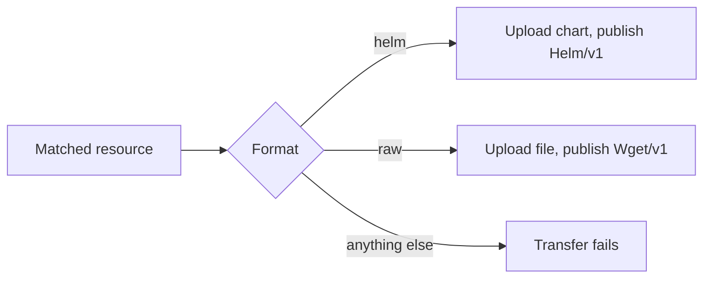

## Goal

Transfer a component version and upload its resources into Sonatype Nexus
Repository 3 hosted repositories, so that consumers fetch them with their usual
tools (`helm`, `curl`, `mvn`).

## You'll end up with

- Resources stored in Nexus hosted repositories of the right format
- A transferred component version whose resources point at those repositories
  (`Helm/v1` for charts, `Wget/v1` for files)

**Estimated time:** ~15 minutes

## How the Nexus uploader works

The
[`nexus.uploader.transfer.config.ocm.software/v1alpha1`]()
uploader routes the resources it matches to one hosted repository. At upload time it
reads the repository format from `GET <url>/service/rest/v1/repositories/<repository>`
and picks the upload method for it:



| Format | Uploaded content                     | Published access                          |
|--------|--------------------------------------|-------------------------------------------|
| `helm` | The Helm chart found in the resource | `Helm/v1` (`helmRepository`, `helmChart`) |
| `raw`  | The resource content as is           | `Wget/v1` on the stored file              |

Every other format fails the transfer before anything is uploaded. See
[Other repository formats](#other-repository-formats) for alternatives.

## Prerequisites

- [OCM CLI]() installed
- A component version in a CTF or OCI repository
- A Nexus **hosted** repository
- A user that may upload into the repository **and read its settings**

## Configure credentials

The uploader resolves credentials for the `HelmChartRepository` identity of
`<url>/repository/<repository>`, falling back to its `Wget` identity. A `Wget`
consumer without a path covers every repository on the server:

```yaml
type: generic.config.ocm.software/v1
configurations:
  - type: credentials.config.ocm.software
    consumers:
      - identity:
          type: Wget
          hostname: nexus.example.com
          scheme: https
        credentials:
          - type: WgetCredentials/v1
            username: <USERNAME>
            password: <PASSWORD_OR_USER_TOKEN>
```


`hostname` is the bare host name. A value such as `https://nexus.example.com`
matches no request, so the upload is sent without credentials and fails with `401`.


## Upload to Nexus

### Helm charts

```yaml
  - type: nexus.uploader.transfer.config.ocm.software/v1alpha1
    match:
      accessType: localBlob
      name: chart
    url: https://nexus.example.com
    repository: helm-hosted
```

Nexus stores the chart as `<name>-<version>.tgz` from its `Chart.yaml`, adds it to
`index.yaml` and the resource is published as:

```yaml
access:
  type: Helm/v1
  helmRepository: https://nexus.example.com/repository/helm-hosted
  helmChart: mychart:0.1.0
```

- `helm pull mychart --version 0.1.0 --repo https://nexus.example.com/repository/helm-hosted`
  returns the chart.
- A second transfer reuses the stored chart, whether the repository allows redeploys
  or not.
- `path` is not supported: Nexus decides where charts are stored.

### Raw files

```yaml
  - type: nexus.uploader.transfer.config.ocm.software/v1alpha1
    match:
      accessType: localBlob
    url: https://nexus.example.com
    repository: raw-hosted
    # optional, defaults to <component>/<component version>/<resource>-<resource version>
    path: '${"files/" + resource.name + ".txt"}'
```

The resource is published as `Wget/v1` on
`https://nexus.example.com/repository/raw-hosted/files/notes.txt`.

Nexus records no owner of a file, so the uploader **never overwrites** a stored file,
even when the repository allows redeploys. A file with the same content is reused; a
file with different content fails the transfer:

```text
nexus repository "raw-hosted" already stores a different file at …; the uploader never overwrites files in raw repositories, configure a different path
```

## Other repository formats

| Repository                  | Error                                       | Alternative                                              |
|-----------------------------|---------------------------------------------|----------------------------------------------------------|
| `maven2`                    | `has format "maven2"; supported: helm, raw` | HTTP uploader with a Maven-layout `targetURL`, see below |
| `npm`                       | `has format "npm"; supported: helm, raw`    | `npm publish`; Nexus rejects plain uploads               |
| Proxy or group repositories | `uploads need a hosted repository`          | Upload into the hosted repository behind it              |

### Maven artifacts

A Nexus `maven2` hosted repository accepts plain `PUT`s at Maven-layout paths
(`com/example/demo/1.0.0/demo-1.0.0.jar` returns `201`) and rejects other paths with
`400 Invalid mavenPath for a Maven 2 repository`. The
[HTTP uploader]()
can deploy there:

```yaml
  - type: http.uploader.transfer.config.ocm.software/v1alpha1
    match:
      accessType: Wget/v1
      name: jar
    method: PUT
    targetURL: '${"https://nexus.example.com/repository/maven-releases/com/example/demo/" + resource.version + "/demo-" + resource.version + ".jar"}'
```

The HTTP uploader reads remote sources such as `Wget/v1`; it cannot upload local
blobs (`failed to get plugin for typ "LocalBlob/v1"`).

## Troubleshooting

### Symptom: `failed detecting the type of … repository …: GET … returned status 401`

**Cause:** No credentials were found for the server, so the uploader asked anonymously.

**Fix:** Configure credentials as shown above, with the bare host name in `hostname`.

### Symptom: `failed detecting the type of … repository …: GET … returned status 403`

**Cause:** The user may deploy but not read the repository settings.

**Fix:** Grant read access to the repository configuration, or use a user that has it.

### Symptom: `nexus repository … already stores a different file at …; the uploader never overwrites files in raw repositories`

**Cause:** The raw repository already stores a file with different content at the
upload path, for example from another component version with the same resource
version.

**Fix:** Configure a `path` that is unique for the resource, or remove the stored file.

### Symptom: `content of resource … is not a helm chart`

**Cause:** The resource matched by a Helm repository uploader holds no packaged chart.

**Fix:** Narrow `match` to the chart resources, or route other resources to a raw
repository.

## Related documentation

- [How-to: Upload Resources to JFrog Artifactory]()
- [Reference: Transfer Configuration]()
- [Tutorial: Configure Custom Uploads During Transfer]()
- [Concept: Transfer and Transport]()
- [Credential Consumer Identities]()
