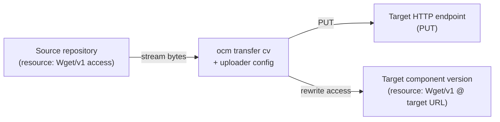

By default, `ocm transfer` either leaves external resources where they are or, with
`--copy-resources`, downloads and re-embeds them into the target component version.
An **uploader configuration** gives you a third option: route a matching resource
through a custom transformer that streams it to an upload target of your choice and
rewrites the resource to point at the new location.

This tutorial configures the built-in **HTTP streaming uploader** to stream a
`Wget/v1` resource to an HTTP `PUT` endpoint during transfer.

## What You'll Learn

- How an uploader configuration matches a resource by access type and routes it to a custom target
- How the HTTP streaming uploader streams content to a `PUT` endpoint without buffering it
- How the transferred resource is rewritten to a `Wget/v1` access at the upload target
- How to template the target URL from the source resource

## How It Works



When a resource's access type matches the uploader's `match`, transfer streams the
resource's bytes straight from the source into an HTTP request to your target URL,
computes (or verifies) its digest as the bytes pass through, and records a new
`Wget/v1` access on the transferred resource pointing at the upload target.

**Estimated time:** ~10 minutes

## Prerequisites

- [OCM CLI]() installed
- A component version containing a resource with `Wget/v1` access (see
  [Working with HTTP Resources]())
- An HTTP endpoint that accepts `PUT` uploads and any credentials it requires
- A target OCM repository (an OCI registry or a CTF archive) for the component descriptor

## Scenario

- **Component:** `ocm.software/demo:1.0.0` with a resource `docs` using `Wget/v1` access
- **Source URL:** `https://source.example.com/artifacts/docs.tar`
- **Upload target:** `https://mytarget.example.com/uploads/artifacts/docs.tar`
- **Config file:** `./ocmconfig.yaml`

## Tutorial Steps




### Write the uploader configuration

Create `ocmconfig.yaml` with a transfer config that copies external resources and
an uploader config that matches `Wget/v1` resources and streams them to your target:

```yaml
type: generic.config.ocm.software/v1
configurations:
  - type: transfer.config.ocm.software/v1alpha1
    copyMode: allResources
  - type: http.uploader.transfer.config.ocm.software/v1alpha1
    match:
      accessType: Wget/v1
    targetURL: '${"https://mytarget.example.com/uploads" + url(resource.access.url).path}'
    method: PUT
```

The `targetURL` is a [CEL](https://cel.dev/) expression wrapped in `${…}`,
evaluated against the source resource, exposed as `resource`. Here
`url(resource.access.url).path` parses the source resource's URL with the inbuilt
`url()` function and takes its path (`/artifacts/docs.tar`), so the expression
resolves to `https://mytarget.example.com/uploads/artifacts/docs.tar`. You can
also use `resource.name`, `resource.version`, other `url()` parts such as
`url(resource.access.url).host`, `resource.extraIdentity.<key>`, and CEL
conditionals. The uploader is not limited to
wget sources: every field of the source access is exposed under
`resource.access.<field>` (e.g. `resource.access.imageReference` for an OCI
source), so you can route any access type to an HTTP target — see the
[Transfer Configuration reference](#cel-expressions).


An uploader only applies to a resource that transfer actually processes. A `Wget/v1`
resource is external, so it is only picked up under `copyMode: allResources`. The
uploader then takes precedence over the default local-blob path for that resource.






### Forward a checksum header (optional)

If the target should receive the resource's digest on the `PUT`, template a header
from `resource.digest`. Header values use the same `${…}` CEL expressions as
`targetURL`; a value without `${…}` is sent as a literal. `resource.digest` is only
present when the source resource carries a digest (for example when it is pinned
from the source via the checksum-http configuration), so keep the rule scoped so
every matched resource has one.

```yaml
  - type: http.uploader.transfer.config.ocm.software/v1alpha1
    match:
      accessType: Wget/v1
    targetURL: '${"https://mytarget.example.com/uploads" + url(resource.access.url).path}'
    method: PUT
    header:
      # RFC 9530 Content-Digest: sha-256=:<base64>:
      Content-Digest: ['${contentDigestAlgorithm(resource.digest.hashAlgorithm) + "=:" + base64.encode(hex.decode(resource.digest.value)) + ":"}']
      # A simple non-standard checksum header carrying the raw hex value.
      X-Checksum-Sha256: ['${resource.digest.value}']
      # A static literal header is sent verbatim.
      X-Uploaded-By: ['ocm-transfer']
```

`resource.digest.value` is the hex digest and `resource.digest.hashAlgorithm` is the
OCM algorithm name (e.g. `SHA-256`). `contentDigestAlgorithm()` maps that name to the
RFC 9530 field key (`sha-256`), and `base64.encode(hex.decode(...))` converts the hex
digest to the base64 value RFC 9530 expects — see the
[Templating Headers reference](#templating-headers).





### Configure target credentials

If your upload endpoint requires authentication, add credentials for the target host.
The uploader resolves credentials for the target URL using the `Wget` consumer
identity, independently of the source resource:

```yaml
  - type: credentials.config.ocm.software
    consumers:
      - identity:
          type: Wget
          hostname: mytarget.example.com
        credentials:
          - type: Credentials/v1
            properties:
              username: uploader
              password: <token>
```

Add this entry to the `configurations` list in `ocmconfig.yaml`. See
[Credential Types]() and
[Credential Consumer Identities]()
for details.





### Run the transfer

Transfer the component version, passing your configuration with `--config`:

```bash
ocm transfer cv \
  --config ./ocmconfig.yaml \
  ghcr.io/source-org/ocm//ocm.software/demo:1.0.0 \
  ghcr.io/target-org/ocm
```

During transfer you will see the streaming step in the progress output, labelled
with the resource and target host:


```text
✓ Transferring component versions...
    ✓ demo@1.0.0 [Stream docs to mytarget.example.com]
    ✓ demo@1.0.0 [Upload to OCI]
    ✓ Cleanup temp files
```


The `[Stream docs to ...]` line is the HTTP streaming uploader performing the `PUT`.





### Verify the rewritten access

Inspect the transferred component version. The `docs` resource now has a `Wget/v1`
access pointing at your upload target:

```bash
ocm get cv ghcr.io/target-org/ocm//ocm.software/demo:1.0.0 -o yaml
```


```yaml
resources:
  - name: docs
    type: blob
    access:
      type: Wget/v1
      url: https://mytarget.example.com/uploads/artifacts/docs.tar
    digest:
      hashAlgorithm: SHA-256
      normalisationAlgorithm: genericBlobDigest/v1
      value: <sha256-of-the-streamed-bytes>
```


The digest was computed while the bytes were streamed to the target. If the source
resource already carried a digest, transfer instead verified it as the bytes passed
through and failed the transfer on any mismatch.

Note the published access carries only `url` (and `mediaType`) — not the `PUT`
method or any upload headers. Those apply to the upload request only, so a later
`ocm download` reads the object with a plain GET instead of re-issuing the write.




## What you've learned

- An uploader configuration matches a resource by access type and streams it to a dedicated target during transfer.
- The `http.uploader.transfer.config.ocm.software/v1alpha1` uploader streams the resource straight to an HTTP `PUT` target without buffering it, and computes or verifies its digest inline.
- The transferred resource is rewritten to a `Wget/v1` **read** access at the upload target (`url` + `mediaType`); the upload request fields (`method`, `header`, `body`, `noRedirect`) drive the `PUT` only and are not recorded on the published access, so a later download reads the object with a plain GET.
- `targetURL` and `header` values are `${…}` CEL expressions over the source resource, so you can template the upload URL and forward headers such as a checksum from `resource.digest`.

## Troubleshooting

### Problem: The resource is not uploaded and keeps its original access

**Cause:** The resource was not processed because `copyMode` left external resources
in place.

**Fix:** Set `copyMode: allResources` in the transfer config (or pass
`--copy-resources`), so the `Wget/v1` resource is processed and the uploader applies.

### Problem: `targetURL` fails to evaluate

**Cause:** The CEL expression references a field that is not available on the
resource, or is not valid CEL.

**Fix:** Reference only documented fields — `resource.name`, `resource.version`,
`resource.access.<field>` (e.g. `resource.access.url`, and `url(...)` parts such
as `url(resource.access.url).path`), `resource.extraIdentity.<key>`,
`resource.digest.value` — and quote string literals (`"https://..."`). A missing
field fails the transfer deliberately rather than producing a partial URL.

### Problem: The upload returns 401/403

**Cause:** No credentials matched the target host.

**Fix:** Add a `credentials.config.ocm.software` consumer with `type: Wget` and the
target `hostname`, as in Step 2.

## Deploy Helm Charts to JFrog Artifactory

The `jfrog.helm.uploader.transfer.config.ocm.software/v1alpha1` uploader
deploys Helm charts into a JFrog Artifactory Helm repository and rewrites the
resource to a `Helm/v1` access. It extracts the chart archive from `Helm/v1`,
`OCIImage/v1`, `LocalBlob` (for example charts added with the `helm` input) or
other remote sources, streams it as a `PUT` to Artifactory under the name and
version from the chart's `Chart.yaml`, and publishes a `Helm/v1` access so
downstream consumers can pull the chart with `helm pull`.

### Uploader configuration

```yaml
type: generic.config.ocm.software/v1
configurations:
  - type: transfer.config.ocm.software/v1alpha1
    copyMode: allResources
  - type: jfrog.helm.uploader.transfer.config.ocm.software/v1alpha1
    match:
      accessType: Helm/v1
    url: https://myorg.jfrog.io
    repository: helm-local
```

### Credentials

Add credentials for the Artifactory host. The uploader resolves them using the
`HelmChartRepository` consumer identity of the Artifactory Helm API, falling back
to the `Wget` consumer identity of the upload URL, so either entry works:

```yaml
  - type: credentials.config.ocm.software
    consumers:
      - identity:
          type: HelmChartRepository
          hostname: myorg.jfrog.io
        credentials:
          - type: HelmHTTPCredentials/v1
            username: <USERNAME>
            password: <PASSWORD>
```

A `type: Wget` identity with `WgetCredentials/v1` works as well, for example to
send the access token as a bearer `identityToken`.

### Transfer and verify

```bash
ocm transfer cv \
  --config ./ocmconfig.yaml \
  ghcr.io/source-org/ocm//ocm.software/demo:1.0.0 \
  ghcr.io/target-org/ocm
```

Inspect the transferred component version:

```bash
ocm get cv ghcr.io/target-org/ocm//ocm.software/demo:1.0.0 -o yaml
```

The resource now carries a `Helm/v1` access:


```yaml
resources:
  - name: mychart
    type: helmChart
    access:
      type: Helm/v1
      helmRepository: https://myorg.jfrog.io/artifactory/api/helm/helm-local
      helmChart: mychart:0.1.0
    digest:
      hashAlgorithm: SHA-256
      normalisationAlgorithm: genericBlobDigest/v1
      value: <sha256-of-the-chart-tgz>
```


For the full field reference, see
[`jfrog.helm.uploader.transfer.config.ocm.software/v1alpha1`](#jfroghelmuploadertransferconfigocmsoftwarev1alpha1).

## Next steps

- [How-to: Transfer Helm Charts with OCM]()
- [How-to: Transfer Components Across an Air Gap]()

## Related documentation

- [Reference: Transfer Configuration]() — full field reference for transfer and uploader configuration
- [Concept: Transfer and Transport]() — how OCM moves component versions between repositories
- [Tutorial: Working with HTTP Resources]() — the `Wget/v1` type produced by the uploader
