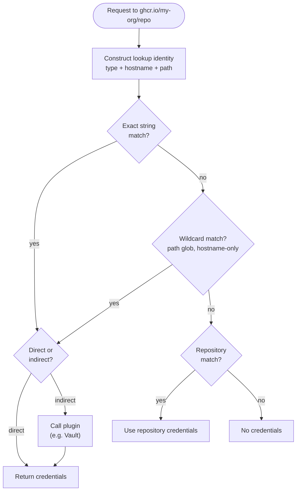

## Overview

Every time OCM accesses a registry, it resolves credentials automatically. This tutorial walks you through how that
resolution works — given a config, which credentials does OCM pick for each request, and why?

This tutorial focuses on OCI registry credentials. For signing credential identities (`RSA/v1alpha1`), see
the [Consumer Identities Reference]().

For the full concept, see [Credential System]().

**Estimated time:** ~10 minutes

## What you'll learn

- How OCM constructs a lookup identity from a request
- How consumers are matched — exact path, glob, hostname-only
- How the fallback from consumers to repositories works
- Why specificity matters when multiple consumers could match

## Prerequisites

- You have the [OCM CLI]() installed
- You are comfortable reading YAML

## How Resolution Works

When resolving credentials, OCM follows three paths in order:

1. **Direct consumers** — the consumer entry holds credentials inline (a typed credential like `OCICredentials/v1` or
   the legacy `DirectCredentials/v1`). These are returned immediately on match.
2. **Indirect consumers** — the credential entry refers to a plugin-backed source (e.g., `HashiCorpVault/v1alpha1`). The
   graph creates a dependency edge at ingestion time; at resolution time, the plugin is called with the credentials
   resolved for its own identity.
3. **Repository fallback** — `DockerConfig/v1` and similar repository plugins. Consulted only when neither direct nor
   indirect lookup yields a result; all repository plugins are queried concurrently and the first success wins.

Consumer entries (direct or indirect) always take priority over repository lookups. This means you can rely on Docker
config for most registries while overriding specific ones with explicit credentials — without touching your Docker
setup.

### Identity Matching

When OCM needs credentials for an operation (e.g., pushing to `ghcr.io/my-org/my-repo`), it constructs a **lookup
identity** — a map of attributes like `type`, `hostname`, `scheme`, `port`, and `path`. It then tries to find a matching
consumer entry in the credential graph.



Matching runs three chained matchers **in order** — all three must pass:

1. **Path matcher** — compares `path` using Go's `path.Match` (glob). If the configured entry has no `path`, any request
   path is accepted. `*` matches exactly one segment (not across `/`).
2. **URL matcher** — compares `scheme`, `hostname`, and `port`. Applies default ports: `https` → `443`, `http` → `80`.
   Schemes must be equal after normalization (`oci` is normalized to `https`); if either side omits the scheme, it
   matches any scheme.
3. **Equality matcher** — all remaining attributes (like `type`) must be exactly equal.

If any matcher fails, the entry is skipped. **First match wins** — OCM returns the first matching entry it finds. The
entries are scanned in no guaranteed order, so if several entries match the same request, the winner is arbitrary.

Quick reference:

| Configured identity                                                  | Request                    | Result | Why                         |
|----------------------------------------------------------------------|----------------------------|--------|-----------------------------|
| `type: OCIRegistry`<br>`hostname: ghcr.io`<br>`path: my-org/my-repo` | `ghcr.io/my-org/my-repo`   | ✅      | Exact path match            |
| `type: OCIRegistry`<br>`hostname: ghcr.io`<br>`path: my-org/*`       | `ghcr.io/my-org/my-repo`   | ✅      | `*` matches `my-repo`       |
| `type: OCIRegistry`<br>`hostname: ghcr.io`                           | `ghcr.io/my-org/my-repo`   | ✅      | No path — accepts any       |
| `type: OCIRegistry`<br>`hostname: ghcr.io`<br>`path: my-org`         | `ghcr.io/my-org/my-repo`   | ❌      | `my-org` ≠ `my-org/my-repo` |
| `type: OCIRegistry`<br>`hostname: ghcr.io`<br>`path: my-org/*`       | `ghcr.io/other-org/foo`    | ❌      | `other-org` ≠ `my-org`      |
| `type: OCIRegistry`<br>`hostname: ghcr.io`<br>`scheme: https`        | `https://ghcr.io:443/repo` | ✅      | Port defaults to `443`      |
| `type: OCIRegistry`<br>`hostname: ghcr.io`<br>`scheme: http`         | `https://ghcr.io/repo`     | ❌      | `http` ≠ `https`            |
| `type: OCIRegistry`<br>`hostname: ghcr.io`<br>`port: 5000`           | `https://ghcr.io:443/repo` | ❌      | `5000` ≠ `443`              |


`*` matches exactly one path segment. It does **not** match across `/` separators. Use `my-org/*/*` to match two-level
paths like `my-org/team/repo`.


### Example A: Simple Hostname Match

The simplest case: a single consumer entry with just a `hostname`. Because no `path` is configured, it acts as a *
*catch-all** for that host.

```yaml
type: generic.config.ocm.software/v1
configurations:
  - type: credentials.config.ocm.software
    consumers:
      - identities:
          - type: OCIRegistry
            hostname: ghcr.io
        credentials:
          - type: Credentials/v1
            properties:
              username: ghcr-user
              password: ghp_token
```

| Request                   | Result           | Why                                           |
|---------------------------|------------------|-----------------------------------------------|
| `ghcr.io/my-org/my-repo`  | ✅ `ghcr-user`    | No `path` in config → accepts any path        |
| `ghcr.io/other-org/thing` | ✅ `ghcr-user`    | Same — hostname matches, path is unrestricted |
| `docker.io/library/nginx` | ❌ No credentials | `docker.io` ≠ `ghcr.io`                       |

**Takeaway:** A hostname-only entry is the broadest match. It catches every request to that host regardless of path,
scheme, or port.

### Example B: Glob Path Matching with Multiple Consumers

Three consumers for the same host, with decreasing specificity:

```yaml
type: generic.config.ocm.software/v1
configurations:
  - type: credentials.config.ocm.software
    consumers:
      # Consumer A: exact path
      - identities:
          - type: OCIRegistry
            hostname: ghcr.io
            path: my-org/production
        credentials:
          - type: Credentials/v1
            properties:
              username: prod-user
              password: ghp_prod
      # Consumer B: glob path
      - identities:
          - type: OCIRegistry
            hostname: ghcr.io
            path: my-org/*
        credentials:
          - type: Credentials/v1
            properties:
              username: org-user
              password: ghp_org
      # Consumer C: hostname only (catch-all)
      - identities:
          - type: OCIRegistry
            hostname: ghcr.io
        credentials:
          - type: Credentials/v1
            properties:
              username: catchall-user
              password: ghp_catchall
```

| Request                     | Matches A? | Matches B? | Matches C? | Why                                                                 |
|-----------------------------|------------|------------|------------|---------------------------------------------------------------------|
| `ghcr.io/my-org/production` | ✅          | ✅          | ✅          | Exact path match on A; `*` also matches `production`; C has no path |
| `ghcr.io/my-org/staging`    | ❌          | ✅          | ✅          | `staging` ≠ `production`, but `*` matches `staging`                 |
| `ghcr.io/my-org/team/repo`  | ❌          | ❌          | ✅          | `*` matches **one** segment — `team/repo` has two. Only C matches   |
| `ghcr.io/other-org/repo`    | ❌          | ❌          | ✅          | `other-org` ≠ `my-org`; only the hostname catch-all matches         |


`*` matches exactly one path segment. It does **not** match across `/` separators. To match two levels like
`my-org/team/repo`, use `my-org/*/*`.


**Takeaway:** OCM first tries an exact string match on the full identity. If that fails, it iterates all configured
entries (in no guaranteed order) and returns the first wildcard match.

### Example B2: Two-Level Wildcard Matching (`*/*`)

What if you want to match exactly two path segments? Use `*/*` to match any organization/repository combination.

```yaml
type: generic.config.ocm.software/v1
configurations:
  - type: credentials.config.ocm.software
    consumers:
      # Consumer A: two-level wildcard for any org/repo
      - identities:
          - type: OCIRegistry
            hostname: ghcr.io
            path: "*/*"
        credentials:
          - type: Credentials/v1
            properties:
              username: org-user
              password: ghp_org_token
      # Consumer B: single-level wildcard scoped to one org
      - identities:
          - type: OCIRegistry
            hostname: ghcr.io
            path: "my-org/*"
        credentials:
          - type: Credentials/v1
            properties:
              username: my-org-user
              password: ghp_my_org_token
```

| Request                            | Consumer A (`*/*`) | Consumer B (`my-org/*`) | Result                         | Why                                          |
|------------------------------------|--------------------|-------------------------|--------------------------------|----------------------------------------------|
| `ghcr.io/my-org/repo`              | ✅                  | ✅                       | ⚠️ `org-user` or `my-org-user` | Both match — the winner is not guaranteed    |
| `ghcr.io/other-org/project`        | ✅                  | ❌                       | ✅ `org-user`                   | Only A matches (two-level wildcard)          |
| `ghcr.io/my-org/team/subteam/repo` | ❌                  | ❌                       | ❌ No credentials               | Path has 4 segments, `*/*` only matches 2    |
| `ghcr.io/singlelevel`              | ❌                  | ❌                       | ❌ No credentials               | Path has 1 segment, `*/*` requires exactly 2 |


`*/*` matches **exactly** two path segments. For three levels, use `*/*/*`, and so on. Each `*` matches one segment
between `/` separators.



**Wildcard precedence is not guaranteed.** An exact identity match always wins, but when several wildcard entries match
the same request, the resolver returns the first match it finds while scanning an unordered collection — there is no
"most specific pattern wins" ranking. If overlapping patterns carry different credentials, either one may be returned.
Keep wildcard patterns non-overlapping.


**Takeaway:** Use `*/*` when you want to match any two-segment path structure (like organization/repository), and avoid
overlapping wildcard patterns with different credentials.

### Example C: URL Normalization — Scheme and Port Defaults

When `scheme` is specified, OCM applies default port mapping:

- `https` without port → defaults to `443`
- `http` without port → defaults to `80`

This means `https://ghcr.io` and `https://ghcr.io:443` are **equivalent**.

```yaml
type: generic.config.ocm.software/v1
configurations:
  - type: credentials.config.ocm.software
    consumers:
      # HTTPS-only entry
      - identities:
          - type: OCIRegistry
            hostname: ghcr.io
            scheme: https
        credentials:
          - type: Credentials/v1
            properties:
              username: secure-user
              password: ghp_secure
      # Custom port registry (no scheme)
      - identities:
          - type: OCIRegistry
            hostname: myregistry.local
            port: "5000"
        credentials:
          - type: Credentials/v1
            properties:
              username: local-user
              password: local_pass
```

| Request                           | Result           | Why                                                                                                                  |
|-----------------------------------|------------------|----------------------------------------------------------------------------------------------------------------------|
| `https://ghcr.io/my-org/repo`     | ✅ `secure-user`  | Scheme matches; no port defaults to `443` on both sides                                                              |
| `https://ghcr.io:443/repo`        | ✅ `secure-user`  | Explicit `443` equals the default `443` for `https`                                                                  |
| `https://ghcr.io:8443/repo`       | ❌ No credentials | Port `8443` ≠ default `443`                                                                                          |
| `http://ghcr.io/repo`             | ❌ No credentials | Scheme `http` ≠ `https`                                                                                              |
| `ghcr.io/repo` (no scheme)        | ✅ `secure-user`  | Empty scheme matches any scheme; the configured `https` becomes the effective scheme, so both ports default to `443` |
| `myregistry.local:5000/repo`      | ✅ `local-user`   | Port `5000` matches; no scheme on either side                                                                        |
| `myregistry.local/repo` (no port) | ❌ No credentials | No scheme on either side means no default port — empty ≠ `5000`                                                      |

The scheme check only fails when **both** sides specify a scheme and the values differ. If one side omits the scheme,
it matches anything, and the side that does specify one determines the default port for the comparison.

**Takeaway:** Port defaults apply when either the config or the request specifies a `scheme`. If both omit it, ports
are compared literally.

### Example D: The `oci` Scheme

Some OCI tools use `oci://` URLs instead of `https://`. The identity matcher normalizes `oci` to `https` before
comparing schemes, so the two are **equivalent**: a config with `scheme: oci` matches both `oci://` and `https://`
requests. Because normalization happens before port defaulting, the `https` default port `443` also applies to `oci`.

```yaml
type: generic.config.ocm.software/v1
configurations:
  - type: credentials.config.ocm.software
    consumers:
      - identities:
          - type: OCIRegistry
            hostname: registry.example.com
            scheme: oci
            port: "443"
        credentials:
          - type: Credentials/v1
            properties:
              username: oci-user
              password: oci_token
```

| Request                                     | Result           | Why                                                           |
|---------------------------------------------|------------------|---------------------------------------------------------------|
| `oci://registry.example.com:443/repo`       | ✅ `oci-user`     | Same scheme (after normalization), same explicit port         |
| `oci://registry.example.com/repo` (no port) | ✅ `oci-user`     | `oci` is normalized to `https`, so the port defaults to `443` |
| `https://registry.example.com:443/repo`     | ✅ `oci-user`     | `oci` ≡ `https` after normalization                           |
| `oci://registry.example.com:5000/repo`      | ❌ No credentials | Port `5000` ≠ `443`                                           |
| `http://registry.example.com/repo`          | ❌ No credentials | `http` ≠ `https` (the normalized form of `oci`)               |


`oci` is an **alias for `https`** in the identity matcher. A config entry with `scheme: oci` matches `https://`
requests and vice versa, and the default port `443` applies. The explicit `port: "443"` in the config above is
therefore optional.


**Takeaway:** Treat `scheme: oci` and `scheme: https` as interchangeable — only `http` is a genuinely different
scheme.

### Example E: When Nothing Matches

This example shows common reasons why credential resolution fails. Given a single specific consumer:

```yaml
type: generic.config.ocm.software/v1
configurations:
  - type: credentials.config.ocm.software
    consumers:
      - identities:
          - type: OCIRegistry
            hostname: ghcr.io
            scheme: https
            path: my-org/*
        credentials:
          - type: Credentials/v1
            properties:
              username: org-user
              password: ghp_org
```

Every request below fails to match:

| Request                            | Why it fails                                                                                |
|------------------------------------|---------------------------------------------------------------------------------------------|
| `https://quay.io/my-org/repo`      | **Wrong hostname** — `quay.io` ≠ `ghcr.io`                                                  |
| `https://ghcr.io/my-org/team/repo` | **Path too deep** — `*` matches one segment, `team/repo` has two                            |
| `https://ghcr.io/my-org`           | **Path too short** — `my-org` does not match `my-org/*` (glob requires a segment after `/`) |
| `http://ghcr.io/my-org/repo`       | **Scheme mismatch** — `http` ≠ `https`                                                      |


There is **no prefix matching** — `path: my-org` does not match `my-org/production`. And `path: my-org/*` does not match
`my-org` either. The glob pattern must match the full path.


**Takeaway:** If you get `401 Unauthorized` unexpectedly, check each attribute: `type`, `hostname`, `scheme`, `port`,
and `path`. Every attribute present on the configured entry must match the request exactly (with glob support for `path`
and port defaults for `https`/`http`).

### Example F: Indirect Credentials (Plugin-Backed)

Direct and indirect consumers look identical from the `.ocmconfig` perspective — the difference is in the `type` of the
credential entry. When OCM encounters a credential type it does not recognize as built-in (not `OCICredentials/v1`,
`HelmHTTPCredentials/v1`, `RSACredentials/v1`, `DirectCredentials/v1`), it treats the entry as **indirect** and looks
for a plugin to resolve it.

The following is a hypothetical example showing what a plugin-backed credential chain would look like. A real
`HashiCorpVault/v1alpha1` plugin does not ship with OCM core — a third-party plugin would need to provide this type.

**Hypothetical Vault chain:** OCI registry credentials would come from HashiCorp Vault, which itself would need
`role_id` and `secret_id` credentials:

```yaml
type: generic.config.ocm.software/v1
configurations:
  - type: credentials.config.ocm.software
    consumers:
      # Consumer A: OCI registry gets credentials from Vault
      - identities:
          - type: OCIRegistry
            hostname: quay.io
        credentials:
          - type: HashiCorpVault/v1alpha1
            serverURL: "https://myvault.example.com/"
            mountPath: "my-engine/my-engine-root"
            path: "my/path/to/my/secret"
      # Consumer B: Vault itself needs role_id + secret_id
      - identities:
          - type: HashiCorpVault/v1alpha1
            hostname: myvault.example.com
        credentials:
          - type: DirectCredentials/v1
            properties:
              role_id: "repository.vault.com-role"
              secret_id: "repository.vault.com-secret"
```

Resolution sequence for a request to `quay.io`:

1. OCM matches consumer A (`quay.io` → `HashiCorpVault/v1alpha1`)
2. The Vault plugin would be asked which identity it needs credentials for — it would return a `HashiCorpVault/v1alpha1`
   identity for `myvault.example.com`
3. OCM resolves consumer B — a direct match returning `role_id` / `secret_id`
4. The Vault plugin would be called with those credentials and would return the final OCI credentials for `quay.io`

This bottom-up traversal supports chains of arbitrary depth. Cycles are detected at ingestion time and rejected.


`HashiCorpVault/v1alpha1` is a hypothetical credential type used here for illustration. Such a type would be provided by
a third-party plugin, not by OCM core. The plugin system supports exactly this pattern — any installed plugin can
introduce new credential types that participate in the credential graph.


**Takeaway:** Indirect credentials look like regular consumer entries. The credential type determines which plugin
handles the resolution. The identity matching rules (exact path, glob, hostname-only) apply the same way as for direct
credentials.

## Troubleshooting

### Problem: `401 Unauthorized` despite having a consumer entry

**Cause:** The lookup identity doesn't match. Common issues: `path` mismatch or wrong `hostname`.

**Fix:** Check that `hostname` and `path` match the request. Remember, `path: my-org` does **not** match
`my-org/production` — there is no prefix matching. See [Identity Matching](#identity-matching) above.

### Problem: `401 Unauthorized` when Docker fallback should work

**Cause:** Docker config doesn't have credentials for that registry.

**Fix:**

```bash
docker login <registry-hostname>
```

Then retry the OCM command.

## Next Steps

- [How-To: Configure Credentials for multiple Repositories ]() -
  Configure OCM to authenticate against multiple OCI registries
- [How-To: Migrate v1 Credentials to v2]() - Migrate an existing OCM
  v1 `.ocmconfig` file so it works with OCM v2

## Related Documentation

- [Concept: Credential System]() - Learn how the credential system
  automatically finds the right credentials for each operation
- [Reference: Consumer Identities]() — Complete
  reference for all identity types (OCI registries and RSA signing)
