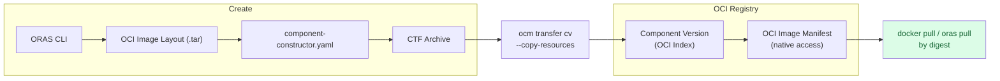
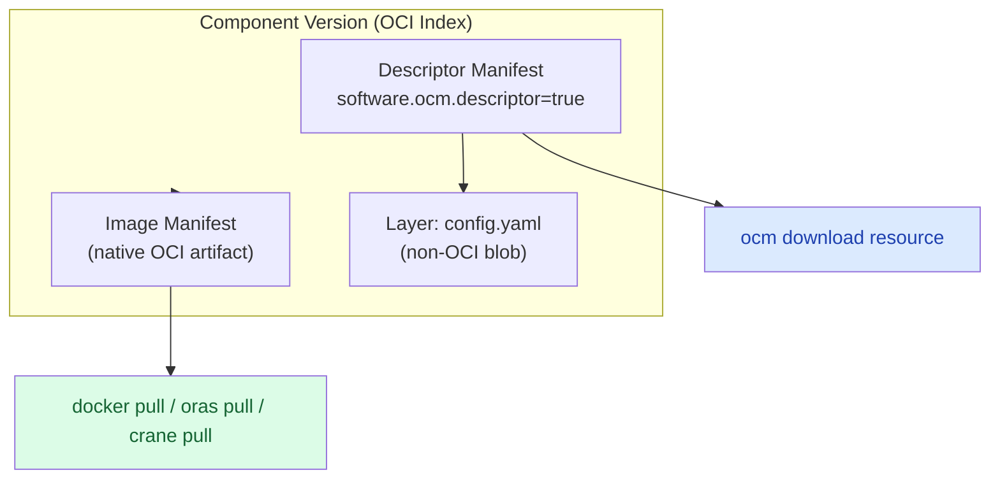

In this tutorial, you'll embed an OCI image layout as a local blob inside a component version and transfer it to an OCI registry where it becomes natively accessible — pullable with standard OCI tools like `docker pull`, `oras pull`, or `crane`.

## What You'll Learn

- Create an OCI image layout using the ORAS CLI
- Embed an OCI image layout as a local blob in a component version
- Transfer a component version with `--copy-resources` so that external OCI image references are internalized as local blobs
- Access local blobs natively from an OCI registry by their digest and media type

**Estimated time:** ~20 minutes

## Scenario

You're packaging a microservice as an OCM component. The component includes a container image that must travel with the component — not just as a reference, but as an embedded artifact. When the component arrives at a target registry, you want the image to be pullable directly with standard OCI tooling, without needing the OCM CLI.

OCM v2 makes this possible through its [OCI-compatible index representation](https://github.com/open-component-model/ocm-spec/blob/main/doc/04-extensions/03-storage-backends/oci.md#62-index-representation). When a component version is stored in an OCI registry, native OCI artifacts (images, Helm charts, OCI image layouts) stored as local blobs are mapped to proper OCI manifests within the component version's index. This means they can be accessed directly by digest using any OCI-compliant client.

## How It Works



The component version is stored as an OCI index. Local blobs with OCI media types are stored as separate OCI manifests within that index, making them natively accessible by their digest.

## Prerequisites

- [OCM CLI installed]()
- [ORAS CLI](https://oras.land/docs/installation) installed (for Use Case 1)
- [jq](https://jqlang.org/) installed (for inspecting JSON)
- Access to an OCI registry (e.g. a local registry via `docker run -d -p 5001:5000 registry:2`)

## Use Case 1: Embed an ORAS-Created OCI Image Layout

In this use case, you create an OCI image layout from scratch using ORAS, embed it in a component version, and transfer it to an OCI registry where it becomes natively accessible.





### Set up a working directory

```bash
mkdir -p /tmp/ocm-native-oci && cd /tmp/ocm-native-oci
```





### Create a sample artifact with ORAS

Create a simple file and package it as an OCI artifact using ORAS. This produces an OCI image layout on disk:

```bash
# Create sample content
echo '{"message": "hello from OCM"}' > artifact.json

# Create an OCI image layout directory using ORAS
mkdir -p oci-layout
oras push --oci-layout oci-layout:latest \
  --artifact-type application/vnd.example.config \
  artifact.json:application/json
```

Verify the layout was created:

```bash
ls oci-layout/
```

You should see the standard OCI image layout structure:

```text
blobs/
index.json
oci-layout
```





### Package the layout as a tar archive

OCM expects OCI image layouts as tar archives with the media type `application/vnd.ocm.software.oci.layout.v1+tar`:

```bash
tar cf oci-artifact.tar -C oci-layout .
```





### Create the component constructor

Create a `component-constructor.yaml` that embeds the OCI image layout as a local blob using the `file/v1` input type:

```yaml
cat > component-constructor.yaml << 'EOF'
# yaml-language-server: $schema=https://ocm.software/latest/schemas/bindings/go/constructor/schema-2020-12.json
components:
- name: github.com/acme.org/native-oci-demo
  version: 1.0.0
  provider:
    name: acme.org
  resources:
    - name: my-oci-artifact
      type: ociArtifact
      version: 1.0.0
      input:
        type: file/v1
        path: ./oci-artifact.tar
        mediaType: application/vnd.ocm.software.oci.layout.v1+tar
EOF
```

Key points:

- The `type: file/v1` input embeds the tar file by value as a local blob
- The `mediaType: application/vnd.ocm.software.oci.layout.v1+tar` tells OCM this is an OCI image layout, not an opaque blob
- During `ocm add cv`, OCM unpacks the layout and stores the contained manifest directly — the resulting local blob has the native OCI media type (e.g. `application/vnd.oci.image.manifest.v1+json`), not the tar media type





### Build the component version

```bash
ocm add cv
```

<details>
<summary>Expected output</summary>

```text
 COMPONENT                          │ VERSION │ PROVIDER
────────────────────────────────────┼─────────┼──────────
 github.com/acme.org/native-oci-demo │ 1.0.0   │ acme.org
```

</details>





### Inspect the component version

Examine the component descriptor to see how the resource was stored:

```bash
ocm get cv ./transport-archive//github.com/acme.org/native-oci-demo:1.0.0 -o yaml
```

<details>
<summary>Expected output</summary>

```yaml
- component:
    name: github.com/acme.org/native-oci-demo
    provider: acme.org
    resources:
      - access:
          localReference: sha256:...
          mediaType: application/vnd.oci.image.manifest.v1+json
          type: localBlob/v1
        name: my-oci-artifact
        relation: local
        type: ociArtifact
        version: 1.0.0
    version: 1.0.0
  meta:
    schemaVersion: v2
```

</details>

Notice that the resource has `access.type: localBlob/v1` with the native OCI manifest media type. OCM recognized the OCI image layout during ingestion, unpacked it, and stored the manifest directly. The `localReference` contains the digest of the embedded manifest.





### Transfer to an OCI registry

Transfer the component version to an OCI registry. The `--copy-resources` flag ensures all local blobs are transferred:

```bash
ocm transfer cv \
  --copy-resources \
  ./transport-archive//github.com/acme.org/native-oci-demo:1.0.0 \
  <your-registry>
```

Replace `<your-registry>` with your registry address (e.g. `http://localhost:5001` for a local HTTP registry, or `ghcr.io/my-org/ocm` for a remote HTTPS registry).


For local registries running without TLS, use the `http://` scheme prefix (e.g. `http://localhost:5001`). HTTPS registries work without a scheme prefix.


During transfer, OCM stores the OCI manifest and its layers as native OCI objects in the registry. The component version's index references the manifest directly.





### Access the image natively

After transfer, inspect the component version in the registry to find the image's digest:

```bash
ocm get cv <your-registry>//github.com/acme.org/native-oci-demo:1.0.0 -o yaml
```

Look for the `globalAccess` field in the resource's access specification — it contains the native OCI image reference including the digest:

```yaml
resources:
  - access:
      localReference: sha256:...
      mediaType: application/vnd.oci.image.manifest.v1+json
      type: localBlob/v1
      globalAccess:
        type: OCIImage/v1
        imageReference: <your-registry>/component-descriptors/github.com/acme.org/native-oci-demo:1.0.0@sha256:...
    name: my-oci-artifact
    type: ociArtifact
```

You can now pull the artifact natively using the digest from `globalAccess.imageReference`:

```bash
# Using ORAS
oras pull <your-registry>/<repository>@sha256:abc123...

# Using crane
crane pull <your-registry>/<repository>@sha256:abc123... image.tar
```





## Use Case 2: Transfer by Value and Access Natively

In this use case, you start with a component version that references an external OCI image, transfer it with `--copy-resources` to internalize the image as a local blob, and then access it natively from the target registry.





### Set up a working directory

```bash
mkdir -p /tmp/ocm-transfer-native && cd /tmp/ocm-transfer-native
```





### Create a component with an external image reference

Create a component that references an existing OCI image by reference (not by value):

```yaml
cat > component-constructor.yaml << 'EOF'
# yaml-language-server: $schema=https://ocm.software/latest/schemas/bindings/go/constructor/schema-2020-12.json
components:
- name: github.com/acme.org/transfer-demo
  version: 1.0.0
  provider:
    name: acme.org
  resources:
    - name: app-image
      type: ociImage
      version: 1.0.0
      access:
        type: ociArtifact
        imageReference: ghcr.io/stefanprodan/podinfo:6.9.1
EOF
```

Build the component version:

```bash
ocm add cv
```





### Inspect the external reference

```bash
ocm get cv ./transport-archive//github.com/acme.org/transfer-demo:1.0.0 -o yaml
```

<details>
<summary>Expected output</summary>

```yaml
- component:
    name: github.com/acme.org/transfer-demo
    provider: acme.org
    resources:
      - access:
          imageReference: ghcr.io/stefanprodan/podinfo:6.9.1@sha256:...
          type: ociArtifact
        name: app-image
        relation: external
        type: ociImage
        version: 1.0.0
    version: 1.0.0
  meta:
    schemaVersion: v2
```

</details>

The image is referenced externally — it still lives in `ghcr.io`. The component descriptor only stores the reference.





### Transfer with --copy-resources

Transfer the component to your target registry, copying all resources by value:

```bash
ocm transfer cv \
  --copy-resources \
  ./transport-archive//github.com/acme.org/transfer-demo:1.0.0 \
  <your-registry>
```


For local registries running without TLS, use the `http://` scheme prefix (e.g. `http://localhost:5001`). HTTPS registries work without a scheme prefix.


With `--copy-resources`, OCM:

1. Downloads the image from `ghcr.io/stefanprodan/podinfo:6.9.1`
2. Stores it as a local blob in the target component version
3. Maps it to a native OCI manifest in the component version's index
4. Updates the access specification with a `localReference` (digest) and `globalAccess` (native OCI reference)





### Inspect the transferred component

```bash
ocm get cv <your-registry>//github.com/acme.org/transfer-demo:1.0.0 -o yaml
```

After transfer with `--copy-resources`, the access specification changes from an external reference to a local blob with global access:

```yaml
resources:
  - access:
      localReference: sha256:...
      mediaType: application/vnd.oci.image.index.v1+json
      referenceName: stefanprodan/podinfo:6.9.1
      type: localBlob/v1
      globalAccess:
        type: OCIImage/v1
        imageReference: <your-registry>/component-descriptors/github.com/acme.org/transfer-demo:1.0.0@sha256:...
    name: app-image
    relation: external
    type: ociImage
    version: 1.0.0
```

Key observations:

- `access.type` changed from `ociArtifact` to `localBlob/v1` — the image is now embedded
- `localReference` contains the digest of the stored image
- `mediaType` is `application/vnd.oci.image.index.v1+json` (or `application/vnd.oci.image.manifest.v1+json` for single-platform images)
- `referenceName` preserves the original image reference for traceability
- `globalAccess` provides the native OCI reference in the target registry
- `relation` remains `external` — this indicates the resource was originally sourced externally, even though it is now stored locally





### Pull the image natively

Use the `globalAccess.imageReference` to pull the image with standard OCI tooling:

```bash
# Using docker
docker pull <your-registry>/<repository>@sha256:...

# Using crane
crane manifest <your-registry>/<repository>@sha256:...
```

The image is stored as a first-class OCI manifest in the registry. No OCM tooling is required to access it — any OCI-compliant client works.

You can also download through OCM:

```bash
ocm download resource <your-registry>//github.com/acme.org/transfer-demo:1.0.0 \
  --identity name=app-image \
  --output app-image-download
```





## What You've Learned

- OCI image layouts can be embedded in component versions using the `file/v1` input type with media type `application/vnd.ocm.software.oci.layout.v1+tar`
- External OCI image references become local blobs when transferred with `--copy-resources`
- OCM v2's [index representation](https://github.com/open-component-model/ocm-spec/blob/main/doc/04-extensions/03-storage-backends/oci.md#62-index-representation) stores native OCI artifacts as proper manifests in the component version's OCI index
- Local blobs with OCI media types are natively accessible by digest using any OCI-compliant tool
- The `globalAccess` field in the access specification provides the native OCI image reference

## How Native Access Works

Under the hood, OCM v2 stores component versions as [OCI Image Indexes](https://github.com/opencontainers/image-spec/blob/main/image-index.md). When a local blob has an OCI-native media type (image manifest, image index, or OCI image layout), it is stored as a separate OCI manifest referenced from the component version's index — not as an opaque layer.



This means:

- **Non-OCI blobs** (plain files, config data) are stored as layers in the descriptor manifest, accessed only through OCM tooling
- **Native OCI artifacts** (images, Helm charts) are stored as separate manifests in the index, accessible both through OCM and directly through any OCI client

## Check Your Understanding


The media type (`application/vnd.ocm.software.oci.layout.v1+tar`) tells OCM that the blob contains a valid OCI image layout. During `ocm add cv`, OCM unpacks the tar, extracts the manifests and layers, and stores them as native OCI objects. The resulting local blob has the native OCI media type (e.g. `application/vnd.oci.image.manifest.v1+json`). Without the correct media type, OCM would store the tar as an opaque layer that cannot be accessed natively.




- **`localReference`** is the digest used internally by OCM to locate the blob within the component version's storage. It works with any OCM repository implementation (CTF archives, OCI registries).
- **`globalAccess`** is an external access specification that provides a location-independent way to access the artifact. In OCI registries, this is typically an `OCIImage/v1` reference with a full image reference including the digest. It allows non-OCM tools to access the artifact directly.




Yes. The `ocm transfer cv` command supports `--upload-as` with two values:

- `--upload-as localBlob` — stores OCI artifacts as local blobs within the component version (default behavior with `--copy-resources`)
- `--upload-as ociArtifact` — uploads OCI artifacts as standalone OCI artifacts in the target registry, separate from the component version

Both options make the artifact natively accessible in OCI registries, but `localBlob` keeps the artifact within the component version's index while `ociArtifact` stores it independently.


## Cleanup

Remove the tutorial artifacts:

```bash
rm -rf /tmp/ocm-native-oci /tmp/ocm-transfer-native
```

## Next Steps

- [How-To: Transfer Components Across an Air Gap]() — Transfer signed components through air-gapped environments
- [How-To: Download Resources from Component Versions]() — Extract resources from components

## Related Documentation

- [Concept: Transfer and Transport]() — Understand resource handling during transfer
- [Reference: Input and Access Types]() — All supported resource types
- [OCM OCI Storage Spec: Index Representation](https://github.com/open-component-model/ocm-spec/blob/main/doc/04-extensions/03-storage-backends/oci.md#62-index-representation) — How component versions map to OCI indexes
