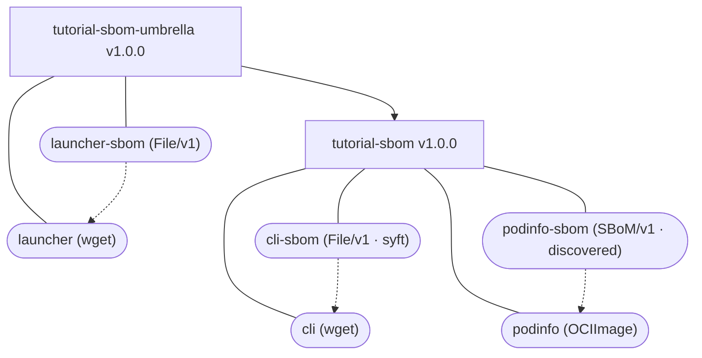

## Overview

OCM lets you attach Software Bills of Materials (SBOMs) to your component **natively**: an SBOM becomes a first-class resource that is transported together with the component and accessed the same way everywhere — whether the component lives in a local archive or an OCI registry. On top of that, OCM can assemble an **orchestrating SBOM** that aggregates the SBOMs of every resource, and recursively of every referenced component, into one document a vulnerability scanner can consume.

In this tutorial you start from a component with **no local resources** — a binary referenced remotely over HTTP and a container image referenced from a registry. You generate an SBOM for the binary with [syft](https://github.com/anchore/syft), let OCM discover the image's SBOM automatically, then assemble and scan an orchestrating SBOM for the whole component tree with [Trivy](https://github.com/aquasecurity/trivy).

**Estimated time:** ~25 minutes

## What You'll Learn

- Generate a CycloneDX SBOM for a binary with `syft`
- Attach an SBOM to a resource with the `ocm.software/sbom` label (the `File/v1` path)
- Discover and bake an OCI image's SBOM at build time with the `SBoM/v1` input type
- Download a single resource's SBOM with `ocm download resource` (an SBOM is a named resource)
- Assemble an orchestrating SBOM for a component version — and recursively across referenced components — with `ocm get sbom`
- Validate the result with `trivy sbom`

## Prerequisites

- [OCM CLI]() installed
- Completed [Create Component Versions]()
- [`syft`](https://github.com/anchore/syft) and [`trivy`](https://github.com/aquasecurity/trivy) installed, plus `curl`
- Optional (for the transfer section): a local OCI registry and `docker`

## How It Works

OCM supports two ways to attach an SBOM to a resource, and this tutorial uses both:



Solid lines are component/resource containment; dotted lines are the `ocm.software/sbom` label linking each SBOM resource back to the resource it describes.

- **`File/v1` + label** — you produce an SBOM yourself (here with `syft`) and attach it as a resource of `type: sbom` carrying a `ocm.software/sbom` label that points back at the resource it describes.
- **`SBoM/v1` input** — OCM discovers the SBOM already attached to an OCI image (as a buildx attestation or via the OCI Referrers API) and bakes it into the component **at build time**, in its original format, auto-adding the back-link label for you.

Both produce the same thing: a `type: sbom` resource stored as a local blob and linked to its subject — so the download tooling treats them identically.

## Scenario

You are packaging a small product: the OCM CLI binary (referenced from its GitHub release over HTTP) and the [podinfo](https://github.com/stefanprodan/podinfo) container image (referenced from `ghcr.io`). Neither is a local file. You want an SBOM for each, and a single orchestrating SBOM for the whole component — and for a parent "umbrella" component that references it — that a scanner can consume.

## Tutorial Steps





### Set up a working directory

```shell
mkdir ocm-sbom-tutorial && cd ocm-sbom-tutorial
```





### Generate the binary's SBOM with syft

The binary is referenced remotely, but no scanner reads a raw URL — so download a **transient** copy just to scan it. The copy is tooling scaffolding; the component will still reference the binary over HTTP.

```shell
curl -sL \
  https://github.com/open-component-model/open-component-model/releases/download/v0.11.0/ocm-linux-amd64 \
  -o /tmp/ocm-cli-bin

syft scan file:/tmp/ocm-cli-bin -o cyclonedx-json=cli.sbom.json
```

Confirm the SBOM was produced:

```shell
$ python3 -c "import json; b=json.load(open('cli.sbom.json')); print(b['bomFormat'], b['specVersion'], '-', len(b['components']), 'components')"
CycloneDX 1.7 - 129 components
```

You now have `cli.sbom.json` — a CycloneDX SBOM you will attach to the binary resource.





### Write the component constructor

Create `component-constructor.yaml`. It defines two components: a leaf (`tutorial-sbom`) carrying the binary and image with their SBOMs, and an umbrella (`tutorial-sbom-umbrella`) that references the leaf and adds one resource of its own.

```yaml
components:
  - name: ocm.software/tutorial-sbom
    version: "1.0.0"
    provider:
      name: ocm.software
    resources:
      # The binary is referenced remotely via wget.
      - name: cli
        type: executable
        version: "1.0.0"
        relation: external
        extraIdentity:
          os: linux
          architecture: amd64
        access:
          type: Wget/v1
          url: https://github.com/open-component-model/open-component-model/releases/download/v0.11.0/ocm-linux-amd64
          mediaType: application/octet-stream
      # The SBOM generated with syft, attached as a local blob and linked to `cli`.
      - name: cli-sbom
        type: sbom
        labels:
          - name: ocm.software/sbom
            version: v1
            value:
              references:
                - resource:
                    name: cli
            signing: true
        input:
          type: File/v1
          path: ./cli.sbom.json
          mediaType: application/vnd.cyclonedx+json
      # A multi-arch OCI image referenced externally.
      - name: podinfo
        type: ociImage
        version: "1.0.0"
        access:
          type: OCIImage/v1
          imageReference: ghcr.io/stefanprodan/podinfo:6.9.1
      # Discover + bake the image's existing SBOM at construction time.
      # podinfo is multi-arch, so this attaches one SBOM per platform.
      - name: podinfo-sbom
        type: sbom
        input:
          type: SBoM/v1
          resource:
            name: podinfo

  - name: ocm.software/tutorial-sbom-umbrella
    version: "1.0.0"
    provider:
      name: ocm.software
    componentReferences:
      - name: tutorial-sbom
        componentName: ocm.software/tutorial-sbom
        version: "1.0.0"
    resources:
      - name: launcher
        type: executable
        version: "1.0.0"
        relation: external
        extraIdentity:
          os: linux
          architecture: amd64
        access:
          type: Wget/v1
          url: https://github.com/open-component-model/open-component-model/releases/download/v0.11.0/ocm-linux-amd64
          mediaType: application/octet-stream
      - name: launcher-sbom
        type: sbom
        labels:
          - name: ocm.software/sbom
            version: v1
            value:
              references:
                - resource:
                    name: launcher
            signing: true
        input:
          type: File/v1
          path: ./cli.sbom.json
          mediaType: application/vnd.cyclonedx+json
```

Two attachment styles sit side by side:

- **`cli-sbom`** uses the `File/v1` input to embed the SBOM you generated, and a `ocm.software/sbom` label to link it to `cli`. The label is marked `signing: true`, so it is covered by the component signature.
- **`podinfo-sbom`** uses the `SBoM/v1` input. It references `podinfo` by name; OCM resolves that reference, discovers the SBOM attached to the image, and bakes it. Because `podinfo:6.9.1` is multi-arch, OCM attaches **every** platform's SBOM — expanding `podinfo-sbom` into one resource per architecture, each tagged with an `os`/`architecture` `extraIdentity`. (Set `resource.extraIdentity.architecture` to attach just one.) The back-link label is added automatically. See the [`SBoM/v1` input type](#sbomv1) reference and [ADR 0026: Native SBOM Support](https://github.com/open-component-model/open-component-model/blob/main/docs/adr/0026_native_sbom_support.md) for the design details.





### Build the component archive

`ocm add cv` defaults to a repository named `transport-archive` and a constructor file named `component-constructor.yaml` in the current directory — both match what we have, so no flags are needed:

```shell
ocm add cv
```

```text
 COMPONENT                           │ VERSION │ PROVIDER
─────────────────────────────────────┼─────────┼──────────────
 ocm.software/tutorial-sbom-umbrella │ 1.0.0   │ ocm.software
 ocm.software/tutorial-sbom          │ 1.0.0   │ ocm.software
```

Inspect the discovered `podinfo-sbom` resources. Because `podinfo` is multi-arch, one was baked **per platform** — each a local blob **in its original SPDX format**, tagged with an `os`/`architecture` `extraIdentity` and the back-link label added for you:

```shell
ocm get cv ./transport-archive//ocm.software/tutorial-sbom:1.0.0 -o yaml
```

```yaml
# ... one podinfo-sbom resource per platform (amd64 shown):
      access:
        localReference: sha256:9ae84e41d0bd9055ae8ef29a0a89013027e6c3680744ba5ead0d4750fe8f337b
        mediaType: application/spdx+json      # original format, not converted
        type: LocalBlob/v1
      extraIdentity:
        architecture: amd64                   # disambiguates the per-platform SBOMs
        os: linux
      labels:
        - name: ocm.software/sbom             # added automatically by SBoM/v1
          value:
            references:
              - resource:
                  name: podinfo
          signing: true
      name: podinfo-sbom
      type: sbom
```





### Download a single resource's SBOM

An SBOM is modelled as an ordinary resource of `type: sbom`, so you download it by its name — no special flag. The `cli-sbom` resource holds the `cli` binary's SBOM:

```shell
$ ocm download resource ./transport-archive//ocm.software/tutorial-sbom:1.0.0 \
    --identity name=cli-sbom --output ./cli.sbom
time=... level=INFO msg="resource downloaded successfully" output=./cli.sbom
```

For a multi-arch image, each platform's SBOM is a separate resource sharing the same name, disambiguated by an `architecture` extra identity — select one by adding it to the identity:

```shell
ocm download resource ./transport-archive//ocm.software/tutorial-sbom:1.0.0 \
    --identity name=podinfo-sbom,architecture=amd64 --output ./podinfo.sbom
```





### Assemble the orchestrating SBOM

`ocm get sbom` collects the baked SBOM of every resource and assembles them into a single CycloneDX document, printed to stdout. Where a resource carries per-architecture SBOMs (like `podinfo`), it picks the one matching your host platform — the same way OCM selects a multi-arch image resource. Redirect stdout to save it. Start with the leaf component:

```shell
ocm get sbom ./transport-archive//ocm.software/tutorial-sbom:1.0.0 > leaf.cdx.json
```

The document is a **flat** CycloneDX BOM — every package sits at the top level, and the component → resource → package hierarchy is expressed through the `dependencies` graph. This is the structure vulnerability scanners expect. Use `-o yaml` for YAML instead of the default JSON.

```shell
$ python3 -c "import json; b=json.load(open('leaf.cdx.json')); print('components:', len(b['components']), '| dependency nodes:', len(b['dependencies']))"
components: 494 | dependency nodes: 613
```





### Aggregate recursively across referenced components

Add `--recursive` to descend into referenced component versions and nest their SBOMs under the parent:

```shell
ocm get sbom ./transport-archive//ocm.software/tutorial-sbom-umbrella:1.0.0 \
    --recursive > umbrella.cdx.json
```

```shell
$ python3 -c "import json; b=json.load(open('umbrella.cdx.json')); print('components:', len(b['components']), '| dependency nodes:', len(b['dependencies']))"
components: 625 | dependency nodes: 616
```

The umbrella's own `launcher` SBOM plus the referenced `tutorial-sbom` component's `cli` and `podinfo` SBOMs are all present, wired together by the dependency graph.





### Validate with Trivy

The orchestrating SBOM is a standard CycloneDX document, so any SBOM-aware scanner can consume it. Scan for vulnerabilities:

```shell
trivy sbom umbrella.cdx.json
```

```text
Report Summary

┌────────┬──────────┬─────────────────┐
│ Target │   Type   │ Vulnerabilities │
├────────┼──────────┼─────────────────┤
│        │ gobinary │       64        │
└────────┴──────────┴─────────────────┘
```

Trivy detects the packages from the aggregated SBOM and reports their known vulnerabilities — proof that the orchestrating SBOM is valid and scannable.





### (Optional) Transfer to an OCI registry and re-run

Everything above works against the local CTF archive. The same commands work against an OCI registry after transfer. If you have a registry running (for example `docker run -d -p 5000:5000 registry:2`):

```shell
# Transfer both components and internalize their resources.
ocm transfer cv --recursive --copy-resources \
  ./transport-archive//ocm.software/tutorial-sbom-umbrella:1.0.0 \
  localhost:5000/sbom-tutorial

# Getting the SBOM works identically against the registry.
ocm get sbom localhost:5000/sbom-tutorial//ocm.software/tutorial-sbom-umbrella:1.0.0 \
  --recursive > umbrella-registry.cdx.json

trivy sbom umbrella-registry.cdx.json
```

Because the SBOMs were baked as local blobs at build time, getting them is a pure read — no live registry discovery is needed, and the result is identical to the CTF run.





## Cleanup

```shell
cd .. && rm -rf ocm-sbom-tutorial /tmp/ocm-cli-bin
```

## What You Learned

- **`syft` + `File/v1` + label** attaches an SBOM you generate yourself, linked to its resource with `ocm.software/sbom`.
- **`SBoM/v1` input** discovers an OCI image's SBOM and bakes it at build time, in its original format, with the back-link label added automatically — attaching every platform's SBOM for a multi-arch image (or one, if you set `platform`).
- **`ocm download resource --identity name=<sbom-resource>`** downloads an SBOM like any other resource (SBOMs are modelled as `type: sbom` resources).
- **`ocm get sbom [--recursive]`** assembles a flat, scannable CycloneDX document for a whole component tree, printed to stdout (JSON or `-o yaml`).
- Because SBOMs are baked at construction, the download works offline against a CTF or a registry alike, and the result is reproducible and signable.

## Next Steps

- [Sign and verify]() the component so the SBOM labels are covered by the signature
- [Working with OCI]() to internalize image resources as local blobs
- [Input and access types]() reference
