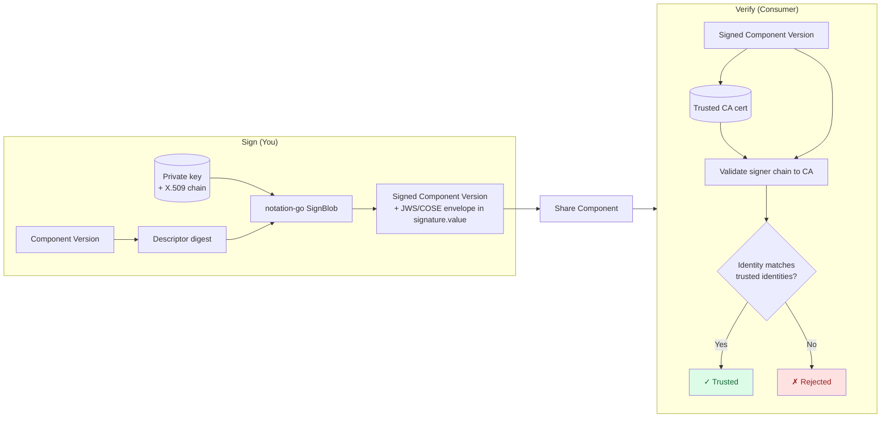

In this tutorial you'll sign a component version with a Notary Project **Notation** signature and verify it again. Signing uses a private key plus its X.509 certificate chain; verification trusts a CA certificate the signer's chain terminates at. The signature itself is a Notation signature envelope (JWS by default, or COSE) embedded in the component descriptor.

Unlike Sigstore (keyless, identity-based), Notation is key-based like RSA, but wraps the signature in the Notary Project's standardized envelope format and enforces the Notary Project trust-store/trust-policy model on verify. OCM runs Notation fully in-process via the [`notation-go`](https://github.com/notaryproject/notation-go) library — there is no external `notation` binary to install and no `~/.config/notation` to manage; all key and trust material comes from OCM credentials.

## What You'll Learn

- Generate an X.509 signing key pair with the Code Signing extended key usage
- Configure OCM to use the Notation signer and Notation credentials
- Sign a component version with `ocm sign cv`, producing a Notation JWS envelope
- Verify the signature by trusting the signer's CA certificate
- Pin the accepted signer identity with a trusted-identity filter

**Estimated time:** ~10 minutes

## How It Works



On the sign side, OCM hashes the descriptor, and `notation-go` signs that digest with your private key, embedding your certificate chain into a JWS or COSE envelope. On the verify side, OCM validates that the embedded chain terminates at a CA certificate you trust and that the recorded identity matches your trusted-identity filter. The envelope is self-contained and travels inside the component descriptor.

## Prerequisites

- [OCM CLI installed]()
- `openssl` on your PATH — to generate a signing key and certificate
- A component version to sign (we'll create one if you don't have one)
- Optional: `yq` for inspecting the signature envelope

## Scenario

- **Component:** `github.com/acme.org/helloworld:1.0.0` in a local CTF archive
- **Working directory:** `/tmp/ocm-notation-tutorial`
- **Signer identity:** an X.509 certificate you generate below

## Steps





### Create a sample component (if needed)

If you already have a component version in a CTF archive, skip to the next step. Otherwise create a small helloworld component:

```bash
mkdir -p /tmp/ocm-notation-tutorial && cd /tmp/ocm-notation-tutorial

cat > component-constructor.yaml << 'EOF'
components:
- name: github.com/acme.org/helloworld
  version: 1.0.0
  provider:
    name: acme.org
EOF

ocm add cv
```

This creates a `transport-archive` directory containing your component version.





### Generate a signing key and certificate

Notation requires the signing certificate to carry the **Code Signing** extended key usage and the **digitalSignature** key usage. Generate a self-signed certificate that satisfies these requirements — it acts as both the signer leaf and the trust anchor:

```bash
cat > csr.cnf << 'EOF'
[req]
distinguished_name = dn
x509_extensions = v3
prompt = no
[dn]
CN = acme.org
O  = Acme
C  = US
[v3]
basicConstraints = critical,CA:false
keyUsage = critical,digitalSignature
extendedKeyUsage = critical,codeSigning
EOF

openssl req -x509 -newkey rsa:3072 -nodes \
  -keyout notation-key.pem \
  -out notation-cert.pem \
  -days 365 -config csr.cnf
```

You now have `notation-key.pem` (private key) and `notation-cert.pem` (certificate). In a real deployment the certificate would be issued by your organization's CA, and verifiers would trust that CA rather than a self-signed leaf.





### Configure the signing credential

Point OCM at your key and certificate by adding a consumer entry to `.ocmconfig`. The `NotationCredentials/v1` credential supplies the private key and chain for signing, and the trusted CA certificate for verification:

```bash
cat > .ocmconfig << EOF
type: generic.config.ocm.software/v1
configurations:
- type: credentials.config.ocm.software
  consumers:
  - identity:
      type: Notation/v1
      signature: default
    credentials:
    - type: NotationCredentials/v1
      privateKeyPEMFile: $(pwd)/notation-key.pem
      certificateChainPEMFile: $(pwd)/notation-cert.pem
      trustedCACertificatesPEMFile: $(pwd)/notation-cert.pem
EOF
```

- **`identity.type: Notation/v1`** — the consumer identity `ocm sign` and `ocm verify` ask for. `signature: default` matches the default signature name; sign with `--signature prod` and you'd add a matching entry.
- **`privateKeyPEMFile` / `certificateChainPEMFile`** — used for signing.
- **`trustedCACertificatesPEMFile`** — used for verification (the anchor the signer chain must terminate at). Here it's the same self-signed certificate.





### Select the signer and verifier

The signer selects which handler runs on sign; the verifier selects it on verify. Append both to the same `.ocmconfig`:

```bash
cat >> .ocmconfig << 'EOF'
- type: signing.config.ocm.software/v1alpha1
  signer:
    type: NotationSigningConfiguration/v1alpha1
  verifier:
    type: NotationVerificationConfiguration/v1alpha1
EOF
```

That's the full configuration for the default JWS envelope. To emit COSE instead, add `envelopeMediaType: application/cose` under `signer`.





### Sign the component version

```bash
ocm sign cv \
  --config ./.ocmconfig \
  ./transport-archive//github.com/acme.org/helloworld:1.0.0
```

<details>
<summary>Expected output</summary>

```text
digest:
  hashAlgorithm: SHA-256
  normalisationAlgorithm: jsonNormalisation/v4alpha1
  value: 4e376182b3d535143e8e009b1e467df3a5b0c1f912c71ae432200654c355606f
name: default
signature:
  algorithm: Notation/v1alpha1
  mediaType: application/jose+json
  value: eyJwYXlsb2FkIjoiZXlKMFlYSm5aWFJCY25ScFptRmpkQ0k2...

time=2026-05-20T15:32:55.725+02:00 level=INFO msg="signed successfully" name=default digest=4e376182b3d535143e8e009b1e467df3a5b0c1f912c71ae432200654c355606f hashAlgorithm=SHA-256 normalisationAlgorithm=jsonNormalisation/v4alpha1
```

</details>

The `value` field is the base64-encoded Notation signature envelope. It embeds the signature bytes and your certificate chain; nothing needs to be fetched at verify time.





### Inspect the signature

```bash
ocm get cv ./transport-archive//github.com/acme.org/helloworld:1.0.0 -o yaml \
  | yq '.[0].signatures[] | select(.signature.algorithm == "Notation/v1alpha1")'
```

You should see the signature carrying `algorithm: Notation/v1alpha1` and `mediaType: application/jose+json` (or `application/cose` if you chose COSE), with the envelope in `value`.





### Verify the signature

Run verify. The Notation handler comes from the `verifier` entry, and the trust anchor from the `NotationCredentials` you configured:

```bash
ocm verify cv \
  --config ./.ocmconfig \
  ./transport-archive//github.com/acme.org/helloworld:1.0.0
```

<details>
<summary>Expected output</summary>

```text
time=2026-05-20T15:35:18.412+02:00 level=INFO msg="verifying signature" name=default
time=2026-05-20T15:35:18.951+02:00 level=INFO msg="SIGNATURE VERIFICATION SUCCESSFUL"
```

</details>

> ✅ **Success!** ✅
> The component version is verified: the signer chain terminated at your trusted CA certificate and the signature bound the descriptor digest.





### Pin the signer identity (optional)

Chain-to-trusted-CA is always enforced. To additionally require a specific signer identity, add a `trustedIdentities` filter to the verifier. The filter uses the Notary Project trusted-identity syntax (`x509.subject: <RFC 4514 DN>`):

```yaml
- type: signing.config.ocm.software/v1alpha1
  verifier:
    type: NotationVerificationConfiguration/v1alpha1
    trustedIdentities:
      - "x509.subject: CN=acme.org,O=Acme,C=US"
```

With this set, verification only succeeds for signers whose certificate subject matches. The default (`["*"]`) trusts any identity that chains to a trusted CA.





## What You've Learned

- ✅ Generated an X.509 signing certificate with Code Signing usage
- ✅ Configured OCM to use the Notation signer and Notation credentials
- ✅ Signed a component version, producing a Notation JWS envelope
- ✅ Verified the signature against a trusted CA certificate
- ✅ Saw how to pin the accepted signer identity

## Where to next

- **Other algorithms?** [Tutorial: Plain Signatures]() (RSA key pair), [Tutorial: Certificate Chains (PEM)]() (RSA + X.509), [Tutorial: Sigstore (Keyless)]().
- **Task-oriented?** [How-to: Sign Component Versions]() and [How-to: Verify Component Versions]().

## Cleanup

```bash
rm -rf /tmp/ocm-notation-tutorial
```

## Related Documentation

- [Concept: Signing and Verification]() — trust models and digest normalization
<!-- TODO(#3625): restore the link to https://github.com/open-component-model/open-component-model/blob/main/docs/adr/0030_notation_signing.md once this PR lands on main. -->
- ADR 0030: Notation Signing — design and trust model
