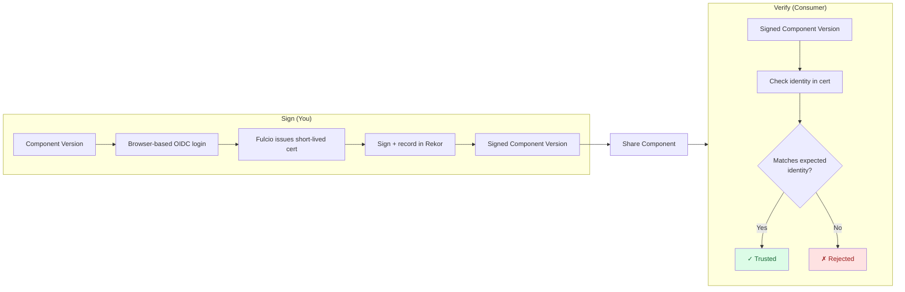

In this tutorial you'll sign a component version with [Sigstore](https://www.sigstore.dev/) and verify it again — without generating a key pair.
Your OIDC identity (Google, GitHub, or Microsoft) is what proves authorship, and a verifier only needs to know which identity to trust.

For the conceptual background — what Fulcio, Rekor, and TUF each do, and how identity-based trust differs from key pinning —
see [Concept: Sigstore (Keyless)]()
and [Concept: Identity-Based Trust]().

## What You'll Learn

- Configure OCM to use your OIDC identity as a signing credential
- Sign a component version with `ocm sign cv` against public Sigstore
- Read the recorded identity out of a Sigstore signature
- Verify the signature by declaring whose identity you trust

**Estimated time:** ~10 minutes

## How It Works



The producer logs in via OIDC; Fulcio binds that login to a short-lived signing certificate; the signature and certificate are recorded in the Rekor transparency log and embedded in the component descriptor. The consumer doesn't need a public key — they declare which OIDC identity they trust, and OCM checks that the signature was made by that identity.

## Prerequisites

- [OCM CLI installed]()
- A web browser on the same machine — signing opens a browser window for OIDC login
- An account at one of {Google, GitHub, Microsoft} — public Sigstore federates with these
- Network access to `*.sigstore.dev` — corporate firewalls sometimes block these
- A component version to sign (we'll create one if you don't have one)


The OCM CLI invokes the `cosign` binary under the hood. If it's not on your PATH (or the version is too old), OCM downloads and caches it under `~/.cache/ocm/cosign/...` on first use. Subsequent runs skip the download.


## Scenario

- **Component:** `github.com/acme.org/helloworld:1.0.0` in a local CTF archive
- **Working directory:** `/tmp/ocm-sigstore-tutorial`
- **Signer identity:** your OIDC login at Google, GitHub, or Microsoft

## Steps





### Create a sample component (if needed)

If you already have a component version in a CTF archive, e.g. by following our [Create a Component Version]() guide, skip to the next step.

Otherwise create a small helloworld component:

```bash
mkdir -p /tmp/ocm-sigstore-tutorial && cd /tmp/ocm-sigstore-tutorial

cat > component-constructor.yaml << 'EOF'
components:
- name: github.com/acme.org/helloworld
  version: 1.0.0
  provider:
    name: acme.org
EOF

ocm add cv
```

<details>
<summary>Expected output</summary>

```text
 COMPONENT                      │ VERSION │ PROVIDER
────────────────────────────────┼─────────┼──────────
 github.com/acme.org/helloworld │ 1.0.0   │ acme.org
```

</details>

This creates a `transport-archive` directory containing your component version.





### Configure the signing credential

Sigstore's signer credential is your OIDC identity, not a private key on disk. Tell OCM to obtain it interactively at sign time by adding a consumer entry to `.ocmconfig`:

```bash
cat > .ocmconfig << 'EOF'
type: generic.config.ocm.software/v1
configurations:
- type: credentials.config.ocm.software
  consumers:
  - identity:
      type: SigstoreSigner/v1alpha1
      signature: default
    credentials:
    - type: OIDCIdentityTokenProvider/v1alpha1
EOF
```

Two things are happening here:

- **`identity.type: SigstoreSigner/v1alpha1`** — when `ocm sign` looks up a credential, this is the consumer identity it asks for. The `signature: default` field matches the default signature name; if you sign with `--signature prod`, you'd add a second entry with `signature: prod`.
- **`credentials.type: OIDCIdentityTokenProvider/v1alpha1`** — instructs OCM to run the interactive OIDC flow (open a browser, exchange the code for a token) instead of reading a static token from the config. This is the only credential type that triggers the browser flow.

No `algorithm` field is needed in the consumer identity — Sigstore is the only signing algorithm that uses this consumer type, so the lookup is unambiguous.





### Create the signer spec

The signer spec selects which signing handler runs. Create `sigstore-sign.yaml`:

```bash
cat > sigstore-sign.yaml << 'EOF'
type: SigstoreSigningConfiguration/v1alpha1
EOF
```

That's the full signer spec for public Sigstore. With no other fields, the handler uses the public-good Fulcio (`fulcio.sigstore.dev`) and Rekor (`rekor.sigstore.dev`) endpoints, with trust roots discovered automatically via TUF.


The signer spec picks **how** to sign (which handler, which endpoints). The `.ocmconfig` consumer identity provides the credential **the handler asks for** (the OIDC token, in this case). Both must be present for signing to succeed — the spec on its own has no token, the credential on its own has no handler. Linking them is the consumer-identity `type` and `signature` fields.






### Sign the component version

Run the sign command with both files:

```bash
ocm sign cv \
  --config ./.ocmconfig \
  --signer-spec ./sigstore-sign.yaml \
  ./transport-archive//github.com/acme.org/helloworld:1.0.0
```

A browser window opens against the public Sigstore login page (Dex). Pick your identity provider (Google, GitHub, or Microsoft), authenticate, and you'll see an OCM "Signing identity verified!" page. Return to the terminal — signing continues automatically.

What just happened, in three sentences: OCM exchanged your OIDC token at Fulcio for a short-lived signing certificate (~10 minutes validity) bound to your email address. It hashed the component descriptor, signed the hash with the ephemeral key, and recorded the entry in the Rekor transparency log. The signature, the Fulcio certificate, and the Rekor inclusion proof are bundled into the component descriptor's `signatures` field as one self-contained blob.

<details>
<summary>Expected output</summary>

```text
digest:
  hashAlgorithm: SHA-256
  normalisationAlgorithm: jsonNormalisation/v4alpha1
  value: 4e376182b3d535143e8e009b1e467df3a5b0c1f912c71ae432200654c355606f
name: default
signature:
  algorithm: sigstore
  issuer: https://accounts.google.com
  mediaType: application/vnd.dev.sigstore.bundle.v0.3+json
  value: eyJtZWRpYVR5cGUiOiJhcHBsaWNhdGlvbi92bmQuZGV2LnNpZ3N0b3JlLmJ1bmRsZS52MC4z...

time=2026-05-20T15:32:55.725+02:00 level=INFO msg="signed successfully" name=default digest=4e376182b3d535143e8e009b1e467df3a5b0c1f912c71ae432200654c355606f hashAlgorithm=SHA-256 normalisationAlgorithm=jsonNormalisation/v4alpha1
```

</details>





### Inspect the signature

Before verifying, take a look at what was actually written to the component descriptor. This is where Sigstore's identity-based trust becomes concrete:

```bash
ocm get cv ./transport-archive//github.com/acme.org/helloworld:1.0.0 -o yaml \
  | yq '.[0].signatures[] | select(.signature.algorithm == "sigstore")'
```

You should see your signature with the recorded identity:

```yaml
name: default
digest:
  hashAlgorithm: SHA-256
  normalisationAlgorithm: jsonNormalisation/v4alpha1
  value: 4e376182b3d535143e8e009b1e467df3a5b0c1f912c71ae432200654c355606f
signature:
  algorithm: sigstore
  issuer: https://accounts.google.com
  mediaType: application/vnd.dev.sigstore.bundle.v0.3+json
  value: <base64-encoded Sigstore bundle>
```

Note the `issuer` field: that's the OIDC provider you logged in with, copied into the component descriptor at sign time. Combined with the email embedded in the bundle's Fulcio certificate, it's everything a verifier needs to decide whether to trust the signature.

The `value` field is the full Sigstore bundle — base64-encoded JSON containing the signature bytes, the Fulcio certificate (with your email as the certificate's Subject Alternative Name), and the Rekor inclusion proof. All three travel with the component descriptor; nothing needs to be fetched at verify time.





### Configure the verifier identity

Verification is "do I trust *this identity*?" — not "do I have *this public key*?" Tell OCM which identity you trust by writing a verifier spec.

Two values matter, both required:

- **`certificateIdentity`** — the email or workload identity of whoever signed (e.g. your own email, copied from the previous step's output)
- **`certificateOIDCIssuer`** — *which* OIDC provider they logged in with (different providers can have the same email)

Create `sigstore-verify.yaml`:

```bash
cat > sigstore-verify.yaml << 'EOF'
type: SigstoreVerificationConfiguration/v1alpha1
certificateOIDCIssuer: https://accounts.google.com
certificateIdentity: jane.doe@example.com
EOF
```

Replace `certificateIdentity` with the email you logged in with, and adjust `certificateOIDCIssuer` to match your provider:

| Signer logged in via | `certificateOIDCIssuer` value |
| --- | --- |
| Google | `https://accounts.google.com` |
| GitHub | `https://github.com/login/oauth` |
| Microsoft | `https://login.microsoftonline.com` |


Public Sigstore uses Dex (`oauth2.sigstore.dev`) as a federation gateway, but the issuer recorded in your signing certificate is the **upstream identity provider** — the one in the table above. Don't put `oauth2.sigstore.dev` here.






### Verify the signature

Run verify with the verifier spec:

```bash
ocm verify cv \
  --verifier-spec ./sigstore-verify.yaml \
  ./transport-archive//github.com/acme.org/helloworld:1.0.0
```

<details>
<summary>Expected output</summary>

```text
time=2026-05-20T15:35:18.412+02:00 level=INFO msg="verifying signature" name=default
time=2026-05-20T15:35:18.951+02:00 level=INFO msg="signature verification completed" name=default duration=539.512209ms
time=2026-05-20T15:35:18.951+02:00 level=INFO msg="SIGNATURE VERIFICATION SUCCESSFUL"
```

</details>

> ✅ **Success!** ✅
> The component version is verified as authentic and signed by the identity you trusted.

What just ran: OCM extracted the Sigstore bundle from the descriptor, validated the Fulcio certificate against TUF-discovered trust roots, checked the Rekor inclusion proof, and finally compared the certificate's identity against your verifier spec. None of those steps required a public key from the signer — the certificate-bound identity is the trust anchor.





## What You've Learned

- ✅ Configured OCM to use your OIDC identity as a signing credential, with no key pair to manage
- ✅ Signed a component version using a short-lived Fulcio certificate
- ✅ Read the recorded identity out of a Sigstore signature
- ✅ Verified the signature by declaring which identity you trust
- ✅ Saw how spec files and `.ocmconfig` consumer identities link via `signature` name

## Where to next

- **Running an enterprise Sigstore stack?** [How-to: Sign Component Versions]() covers the `signingConfig` field and the `trusted_root_json` credential for private deployments.
- **Curious about the theory?** [Concept: Signing and Verification]() explains identity-based trust, how it differs from RSA key pinning, and why Sigstore works in air-gapped scenarios.
- **Other algorithms?** [Tutorial: Plain Signatures]() (RSA key pair) and [Tutorial: Certificate Chains (PEM)]() (PKI-based).

## Cleanup

```bash
rm -rf /tmp/ocm-sigstore-tutorial
```

## Related Documentation

- [Concept: Signing and Verification]() — Identity-based trust and the Sigstore stack
- [How-to: Sign Component Versions]() — Task-oriented sign reference (RSA and Sigstore)
- [How-to: Verify Component Versions]() — Task-oriented verify reference
- [ADR 0017: Sigstore Integration](https://github.com/open-component-model/open-component-model/blob/main/docs/adr/0017_sigstore_integration.md) — Sigstore design and OIDC flow details
